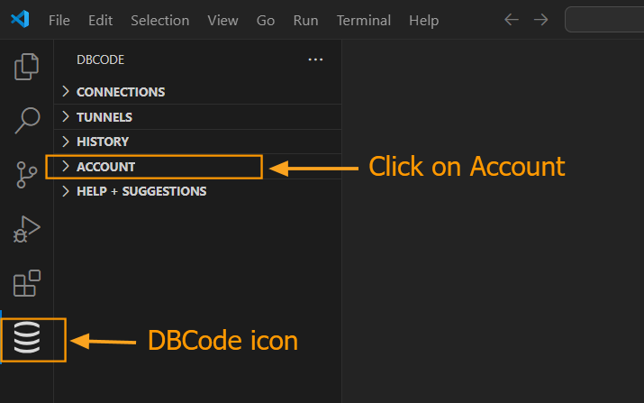
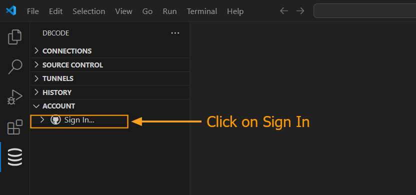
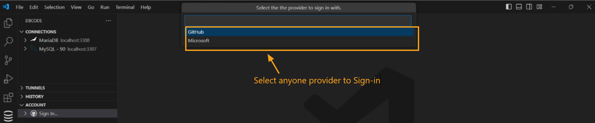
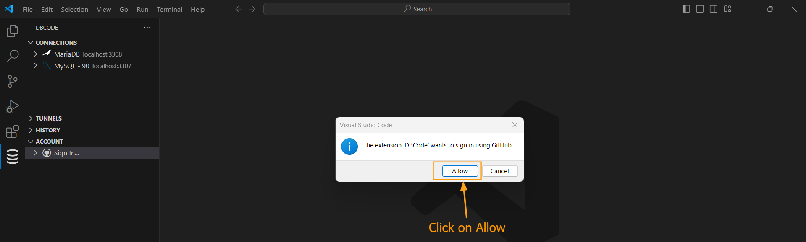
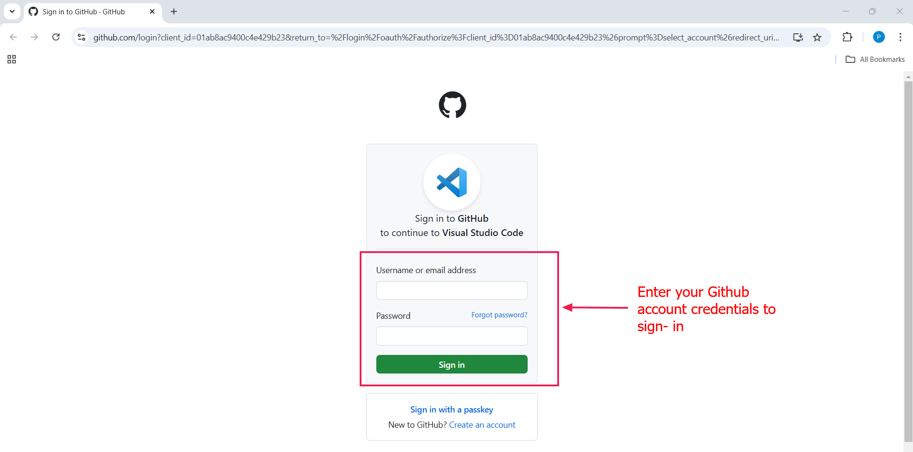
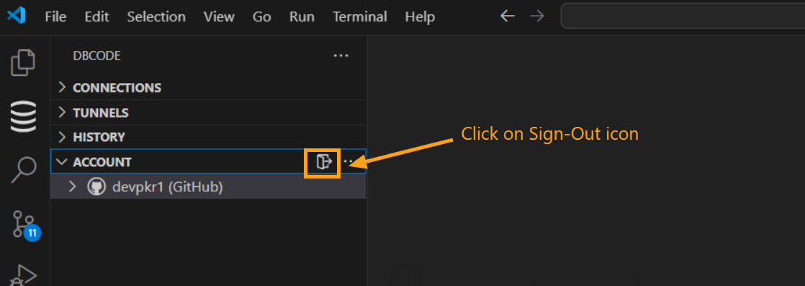

---

title: Sign In
description: A step-by-step guide to securely sign in to DBCode, explore its features during the trial, and transition to a subscription for uninterrupted access to your database workflows.  
order: 1  

---

## Signing In to DBCode  

Signing in to DBCode is your gateway to powerful database management tools. Enjoy the trial period to explore features, manage projects, and streamline workflows. When ready, upgrade to a subscription for continuous access. Follow this guide to sign in seamlessly and troubleshoot any issues.  

---

### How to Sign In

**1. Open DBCode in Visual Studio Code**  
- Launch Visual Studio Code and click the DBCode icon from the Activity Bar on the left.  

**2. Navigate to the Account Tab**  
- In the DBCode sidebar, locate and click on the **Account** tab.  

     

**3. Select the Sign-In Option**  
- Click on the **Sign-In** button within the **Account** tab.  

     

**4. Choose Your Sign-In Provider**  
- Select your preferred sign-in provider (Microsoft or GitHub) from the prompt.  

     

- A browser prompt will appear asking permission to open a link. Click **Allow**.  

     

**5. Enter Your Credentials**
- Provide your email and password based on the selected provider.  
  - For Microsoft, use your Microsoft account credentials.  
  - For GitHub, use your GitHub username and password.  

     

**6. Complete the Sign-In**  
- Click **Sign In** to securely log in to DBCode.  
- Upon successful authentication, you will gain access to DBCode in Visual Studio Code.  

---

### **Troubleshooting Sign-In Issues**  

**Forgot Password**  
- Click on the **Forgot Password?** link on the sign-in screen.  
- Enter your registered email address and follow the instructions sent to reset your password.  

**Invalid Credentials**  
- Verify your email and password for accuracy.  
- Check if the password is case-sensitive and ensure proper formatting.  

---

### **How to Sign Out**  

**1. Open DBCode in Visual Studio Code**  
- Launch Visual Studio Code and click the DBCode icon in the Activity Bar.  

**2. Access the Account Tab**  
- Go to the **Account** tab in the DBCode sidebar.  

**3. Click Sign-Out**  
- Click the **Sign-Out** icon next to your account details.  

     

- You will be logged out successfully.  

---

By following these steps, you can securely sign in to DBCode and access its database tools. Take advantage of the free core features or subscribe to unlock the full power of DBCode. For additional support, contact the DBCode team.