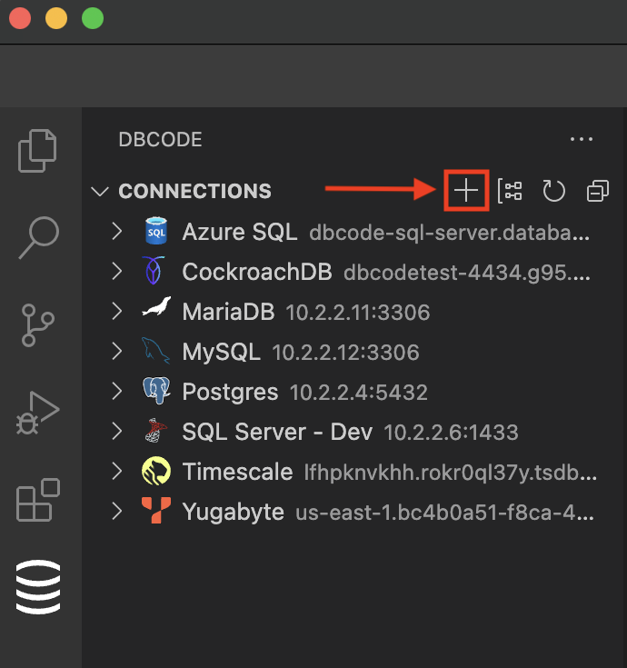
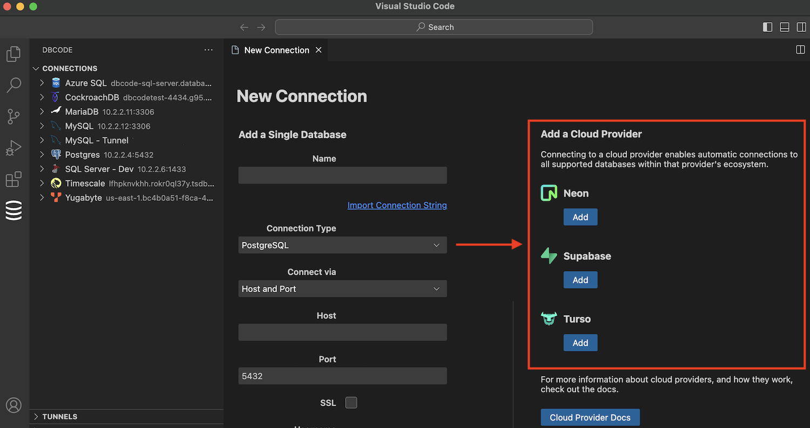
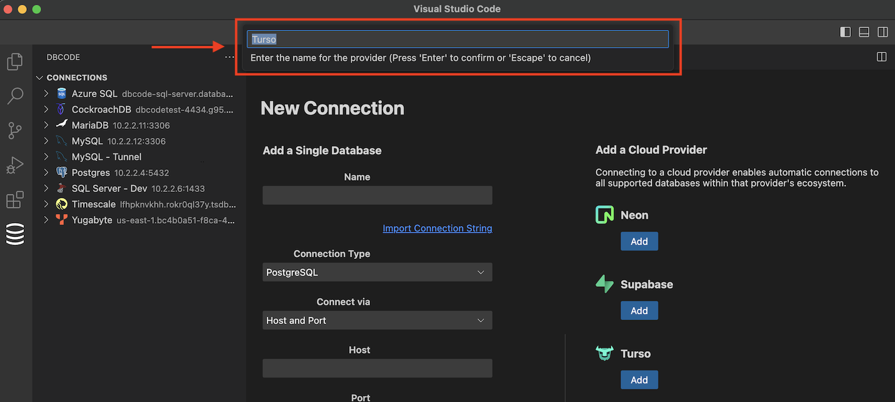
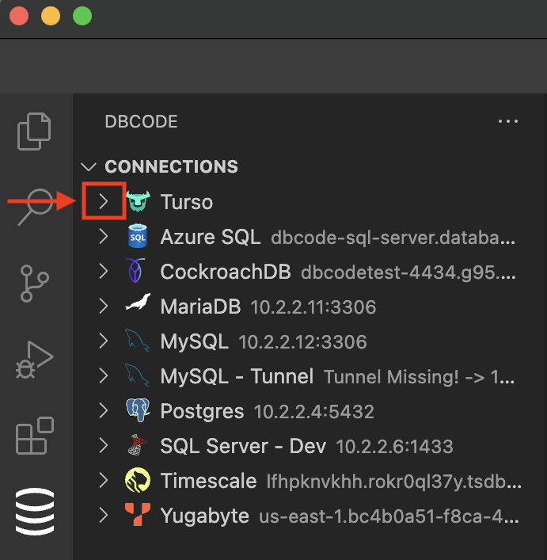
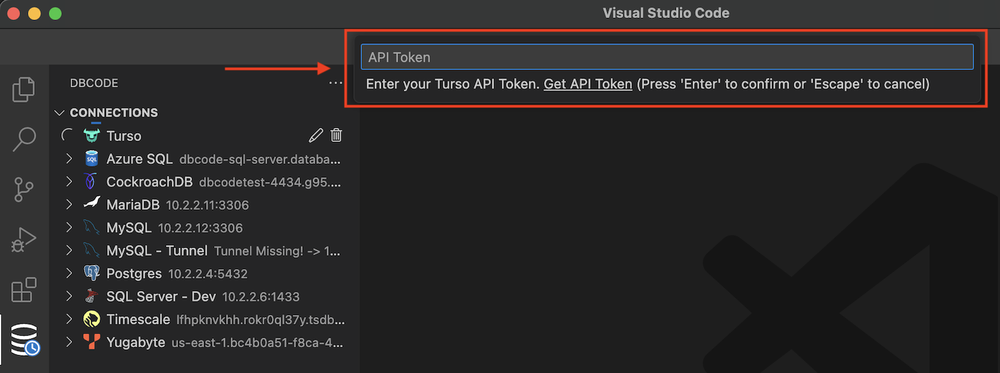
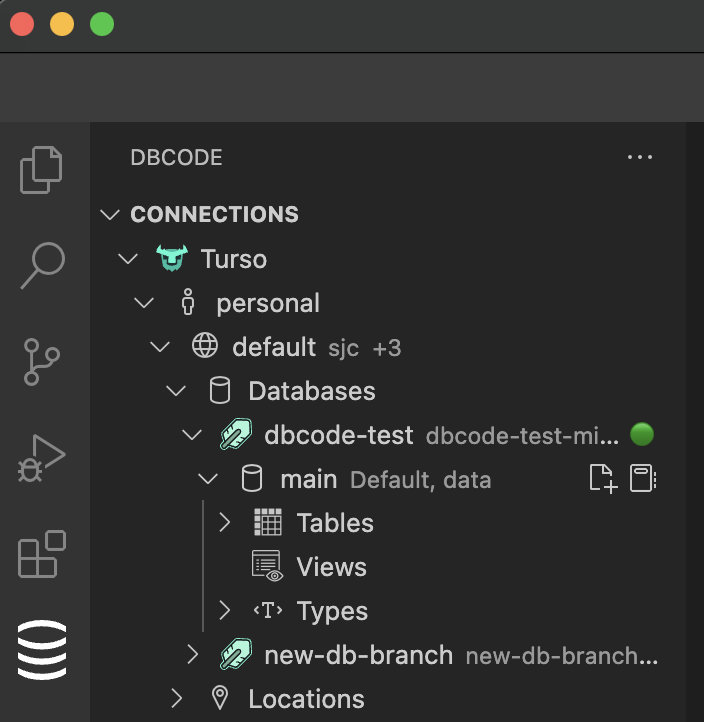

Follow these steps to set up a connection to a cloud provider.

## Add

Click on the "Add Connection" icon in the DBCode extension.

## Select

Choose a cloud provider from the right-hand side.

For this guide, we will use the Turso provider, but the process is the same across all providers. 

Click "Add"

## Name

Enter a name for the connection. This name will be displayed in the DBCode Explorer. You can connect to the same provider multiple times, for example, if you have separate production and development accounts.

## Use

Expand the provider in the DBCode Explorer.

The first time you do this, the provider will prompt you for authentication details, which vary by provider.

Refer to the detailed information in this section for specific requirements for each provider.

## Access Your Databases

Navigate through the projects and databases within the provider to access your databases.

You can now run queries, manage data, and utilize all the features of the DBCode extension with your cloud provider's databases.

## Security

The credentials you enter for a cloud provider are stored in the Visual Studio Code secret storage facility and are not synced across Visual Studio Code instances, ensuring they remain only on your computer.
