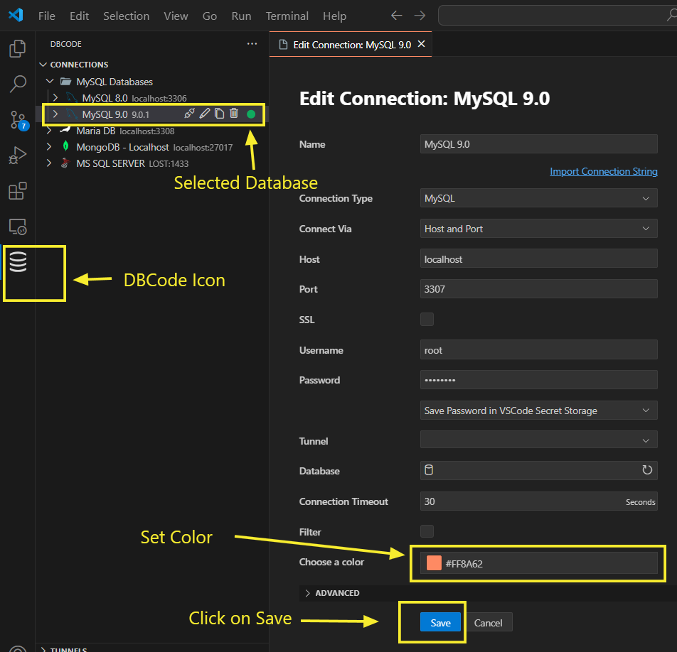
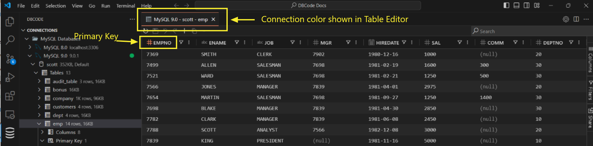
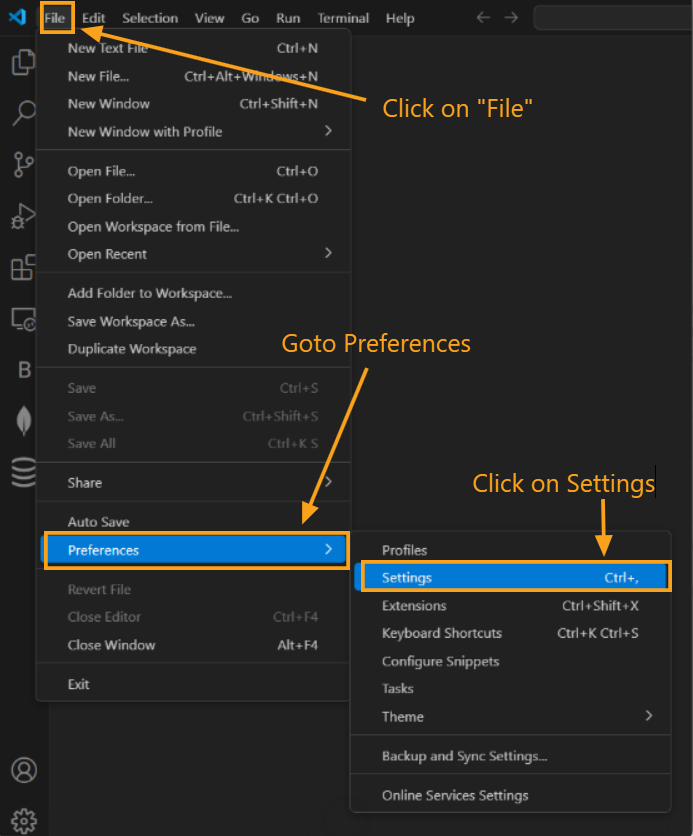
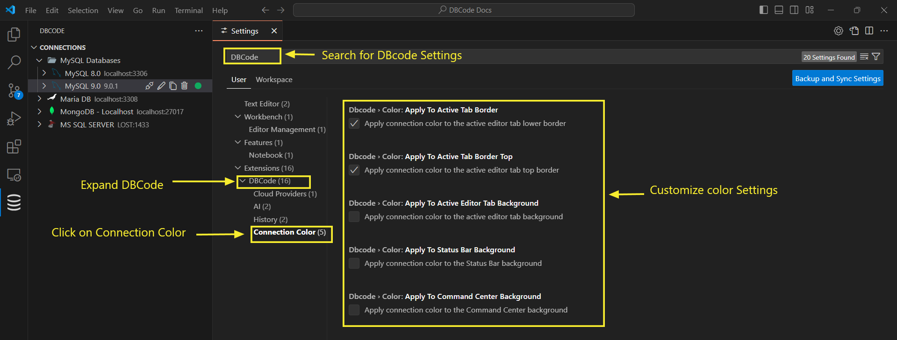

---

Title: Color

Description: Learn how to set custom colors for your database connections in DBCode to differentiate between connections and reduce errors when navigating multiple tabs.

Order: 8

---

## Customizing Connection Colors in DBCode

Assigning custom colors to your connections in DBCode allows you to visually organize and quickly recognize different environments (e.g., development, staging, production).

### Adding a Color to a Connection

1. **Open DBCode in Visual Studio Code:**
   - Launch Visual Studio Code and click on the DBCode icon in the Activity Bar (typically on the left side).

2. **Select the Connection:**
   - In the DBCode Explorer, locate the connection you want to color-code.

3. **Set a Connection Color:**
   - Right-click the connection and choose **Edit Connection** from the context menu.

   - In the **Edit Connection** tab, scroll down to **Choose a Color** and select a color that represents the connection. Click **Save** to apply the settings.

   - Once set, this color will persist across Visual Studio Code restarts, providing a consistent visual indicator.

   

   - The assigned color will appear in the following places:

     - The primary key (PK) indicator for tables in the connected database.

     - The Editor tab associated with the connection.
     
     - The SQL file header associated with the connection.

   

### Modifying Color Settings in the Extension Settings

To adjust default color settings for all connections, you can customize the DBCode extension settings in Visual Studio Code:

1. **Open Settings:** Go to **File** > **Preferences** > **Settings** (or press *Ctrl+,*).

   

2. **Search for DBCode:** In the settings search bar, type “DBCode.”

3. **Configure DBCode Settings:** Under **Extensions**, expand **DBCode** and click on **Connection Color**. Adjust the color settings as needed.

4. **Restart Visual Studio Code:** Changes will take effect after restarting Visual Studio Code and will persist across future sessions.

   

---

### Additional Notes

DBCode applies custom colors across the DBCode Explorer, Editor tab, and SQL file header, maintaining a consistent look while aligning with brand guidelines by leaving primary connection icons unchanged.