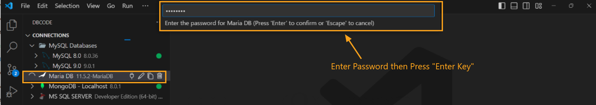

## Connecting to an Existing Database

1. **Open DBCode in Visual Studio Code:**
   - Launch Visual Studio Code and click on the DBCode icon in the Activity Bar (typically on the left side).

   

2. **Locate Your Saved Connections:**
   - In the DBCode explorer, you’ll see a list of previously saved connections.

3. **Initiate the Connection:**
   - Right-click on the desired connection and select **Connect** from the context menu.

   - You can also connect by clicking the **Connect** icon beside any disconnected connection.
   
   - Alternatively, you can single-click on the connection name to initiate the connection.

   

4. **Authenticate if Necessary:**
   - If additional authentication is required (such as entering a password), a prompt will appear. Enter the credentials as needed to complete the connection process.

   

5. **Confirm the Connection:**
   - Once connected, a green dot will appear next to the connection name, confirming that the database is successfully connected.
   - You can now browse tables, views, and other database objects directly within the explorer.

   

6. **Start Working with Your Data:**
   - After connecting, you can run queries, edit data, and manage the database structure using DBCode’s features.

## Disconnecting from the Database

- **To Disconnect:**
   - Right-click on the connected database and select **Disconnect** to end the session.
   - Alternatively, click the **Disconnect** icon in front of the connected database name to disconnect.
   - This will close the connection while retaining your saved settings for future use.

   

---

Connecting to an existing database with DBCode provides fast, easy access to your data and tools, making it efficient to work with your saved connections whenever needed.