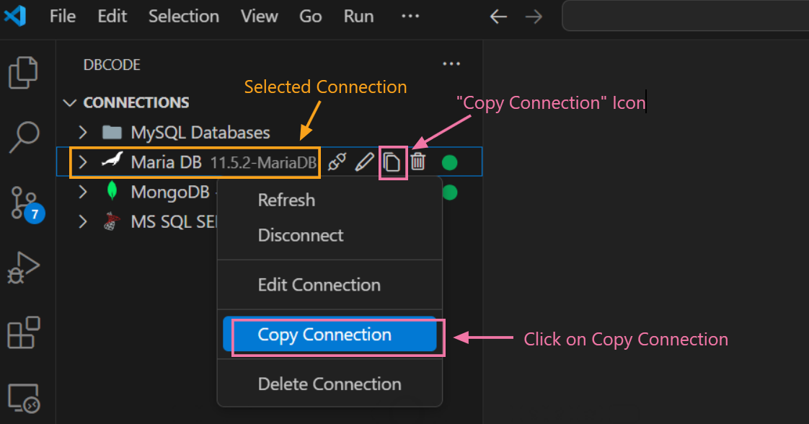
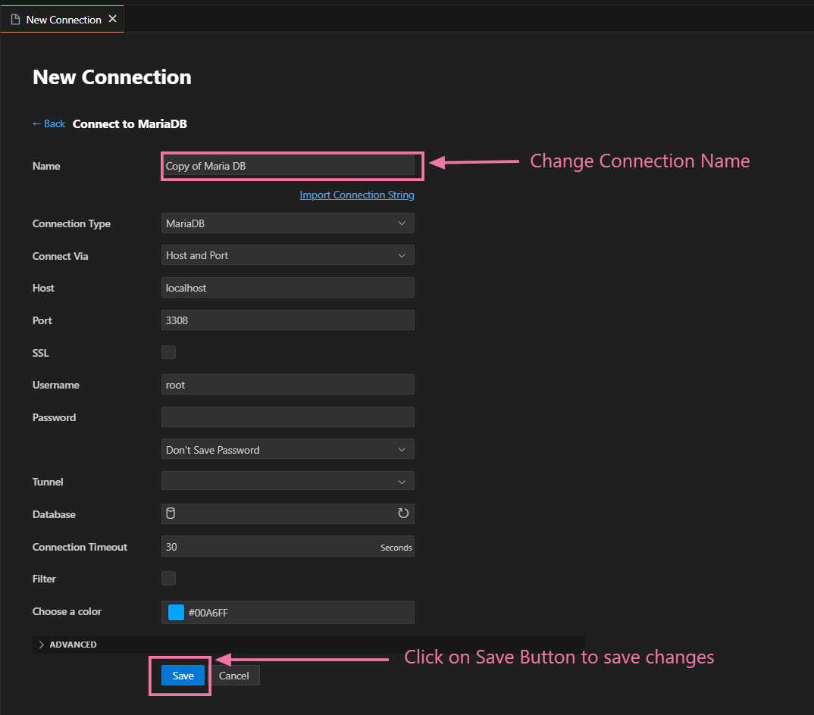
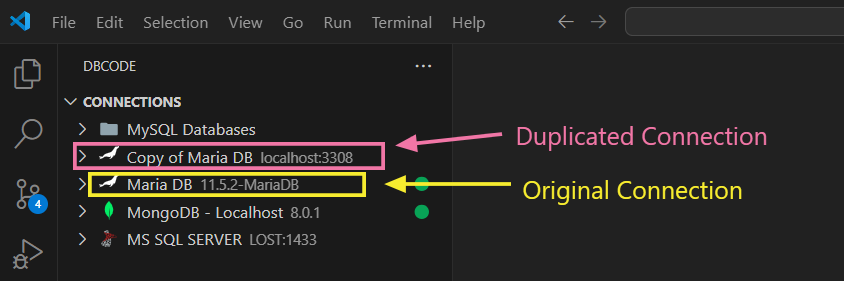

---

title: Copy

description: Create a duplicate of an existing database connection in DBCode, allowing you to reuse connection settings or make slight modifications without starting from scratch.

order: 5

---

## Copying a Database Connection

1. **Open DBCode in Visual Studio Code:**
   - Launch Visual Studio Code and click on the DBCode icon in the Activity Bar (typically on the left side).

   

2. **Locate the Connection to Copy:**
   - In the DBCode explorer, find the connection you want to duplicate.

3. **Copy the Connection:**
   - Right-click on the connection and select **Copy Connection** from the context menu.

   - Alternatively, you can click on the `Copy Connection` icon beside connection name as shown below.

  

4. **Modify the Duplicate Connection (if needed):**
   - After clicking on `Copy Connection`, a `New Connection` tab with the same settings will appear in the main area as shown below. You can rename or modify any details, such as the server name, username, or connection name.

   - Once you have adjusted the settings (if necessary), save the copied connection.

   

5. **Use the Copied Connection:**
   - You can now use the duplicate connection just like the original, including connecting, refreshing, or further customizing as needed.

   

## Why Use Copy Connection

- **Quick Setup for Similar Databases:** If you’re working with multiple databases on the same server or with similar configurations, copying a connection saves time by duplicating settings.

- **Experimenting with Variations:** Copying allows you to create variations of a connection for testing purposes without affecting the original settings.

---

Copying a connection in DBCode simplifies managing multiple similar connections, helping you work more efficiently across different database environments.