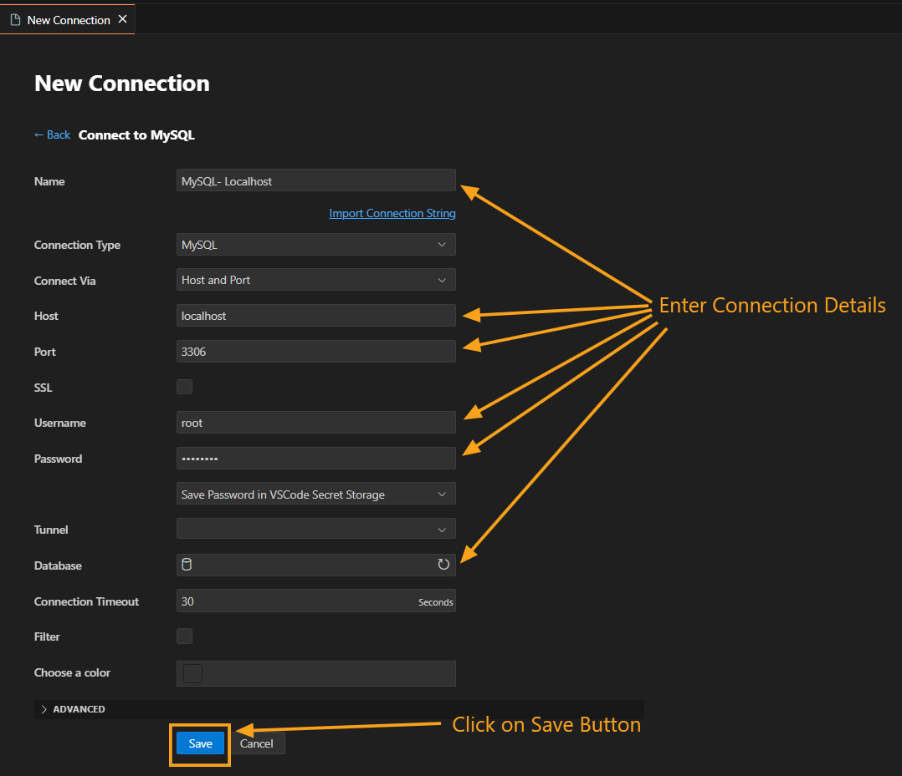

## Setting Up a New Database Connection

1. **Launch DBCode in Visual Studio Code:**
   - Open Visual Studio Code, then click the DBCode icon in the Activity Bar (typically on the left side).

   

2. **Add a Connection:**
   - Click on **Add Connection** or the **+** icon in the DBCode explorer.

   

   - Alternatively, open the Command Palette (*Ctrl/Cmd + Shift + P*) and search for "DBCode: Add Connection."

   

3. **Choosing Database Type:**
   - Choose Database type by clicking on connect button in front of each database type (e.g., MySQL, PostgreSQL, SQL Server) as shown below.
   - You can select database type from SQL, NoSQL and Warehouses different categories

   

4. **Enter Connection Details:**
   - **Server Name:** Name your connection (e.g., "My Database").
   - **Host:** Provide the server’s host address (e.g., "localhost" or the server IP).
   - **Port:** Specify the port (e.g., 3306 for MySQL, 5432 for PostgreSQL, 1433 for SQL Server).
   - **Username:** Enter your database username.
   - **Password:** Provide the database password.
   - **Database:** Specify the database name you wish to access.

5. **Save the Connection:**
   - After entering the required details, click **Save** to establish the connection.

   

   You’re now connected and ready to explore your database directly within DBCode.

## Connecting a Cloud Provider

Connecting a cloud provider allows you to access multiple databases within that provider, without the need for individual configurations. For more detailed instructions, refer to the [Cloud Provider Integration Guide](/docs/cloud-providers).

## Exploring with the Sample Database

To quickly explore DBCode’s features, use the built-in sample database:

1. **Open the Sample Database:**
   - In Visual Studio Code, click the DBCode icon in the Activity Bar.
   - Select **Explore with a Sample Database** in the DBCode explorer or use the Command Palette (*Ctrl/Cmd + Shift + P*) and choose "DBCode: Explore with a Sample Database."

   

2. **Load and Explore:**
   - Select **Sample Database** to load it.

   The sample database is now ready to explore, allowing you to familiarize yourself with DBCode’s tools and capabilities.