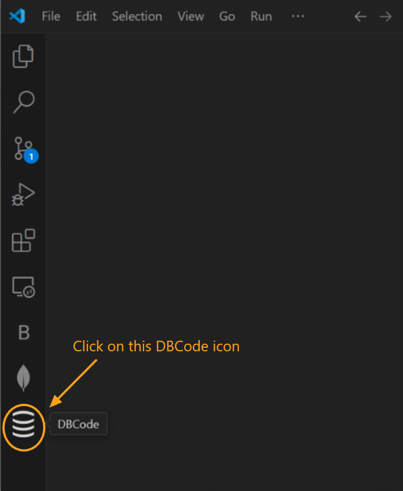

---

title: Delete

description: Permanently remove a database connection from DBCode when it is no longer needed.

order: 7

---

## Deleting a Database Connection

Deleting a connection in DBCode is a straightforward way to remove any connections you no longer need, keeping your workspace organized and focused.

1. **Open DBCode in Visual Studio Code:**
   - Launch Visual Studio Code and click on the DBCode icon in the Activity Bar (usually on the left side).

   

2. **Locate the Connection to Delete:**
   - In the DBCode explorer, find the connection you wish to delete. Ensure it is disconnected before proceeding.

3. **Delete the Connection:**
   - Right-click on the connection name and select **Delete Connection** from the context menu.

   - Alternatively, you can click on the `Delete Connection` icon beside connection name as shown below.

   

   - A confirmation prompt will appear. Click **Yes** to confirm and permanently remove the connection.

   

4. **Connection Removed:**
   - The connection will be deleted from your list, and it will no longer be accessible in DBCode. 
   
   - If you need to connect to this database again, you will have to recreate the connection.For more information, check out the [create connection](docs/connections/create) article.

## Important Notes

- **Deleting a Grouped Connection:** If the connection you’re deleting is part of a group, only the specific connection will be deleted, not the entire group.

- **Data Safety:** Deleting a connection in DBCode only removes the saved connection details. It does not delete any data in the database itself.

---

Deleting unused connections in DBCode keeps your workspace clean and organized, allowing you to focus on active databases.