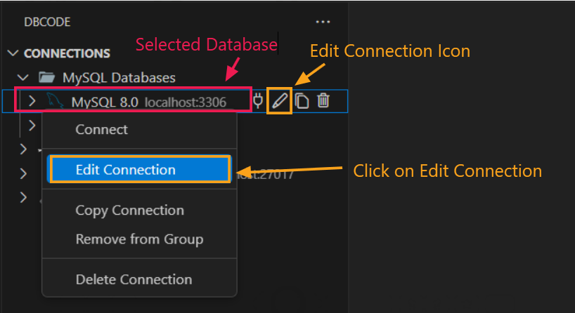

## Editing an Existing Connection

1. **Open DBCode in Visual Studio Code:**
   - Start Visual Studio Code, then select the DBCode icon in the Activity Bar (typically on the left side).

   

2. **Locate Your Connection:**
   - In the DBCode `Connections` pane, find the list of your saved connections.
   - Then click on pencil icon besides connection name or right-click on the connection you want to modify, then choose **Edit Connection** from the context menu.
   
   

3. **Update Connection Details:**
   - A settings panel will open, allowing you to adjust the following details:
     - **Server Name:** Update the connection name if needed.
     - **Type:** Modify the database type (e.g., MySQL, PostgreSQL) if it has changed.
     - **Host:** Change the server’s host address, such as updating to a new IP or domain.
     - **Port:** Update the port number if the server port has changed (e.g., 3306 for MySQL, 5432 for PostgreSQL).
     - **Username:** Enter a new username if access credentials have changed.
     - **Password:** Update the password for secure access.
     - **Database:** Adjust the database name if connecting to a different one within the same server.

4. **Save the Updated Connection:**
   - After making the necessary changes, click **Save** to apply the updates to the connection.

   

   DBCode will test the new settings to ensure the connection works correctly. If any details are incorrect, you’ll receive an error message to help troubleshoot.