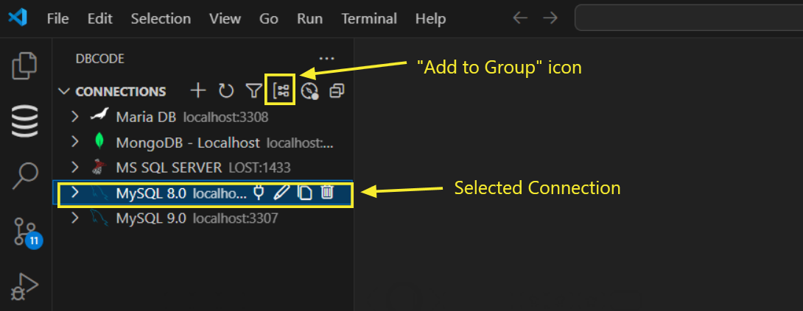
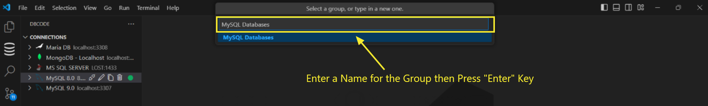
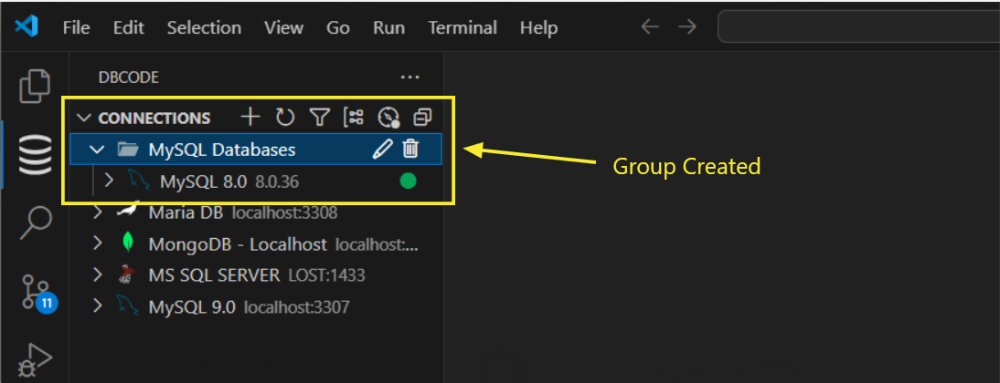

---

title: Group  
description: Organize and manage multiple database connections by grouping them in DBCode for better navigation and a more organized workspace.  
order: 6  

---

## Grouping Connections in DBCode  

DBCode enables you to organize multiple database connections into groups, helping you manage environments like development, testing, and production efficiently. Grouping connections simplifies navigation and keeps your workspace tidy.  

---

### Creating a Group  

1. **Open DBCode in Visual Studio Code**  
- Launch Visual Studio Code and click the DBCode icon in the Activity Bar (typically on the left side).  

    

2. **Select Connections to Group**  
- In the **Connections Pane**, hold down the `Ctrl` key (or `Cmd` on macOS) and select one or more connections to group.  

- Click the **Add to Group** icon in the toolbar or right-click and select **Add to Group** from the context menu.  

    

- A prompt will appear asking you to name the new group.  

    

3. **Name the Group**  
- Enter a name for the group and press **Enter**.  

- The selected connections will now be listed under the new group.  

    

---

### Adding Connections to an Existing Group  

1. **Select a Connection**  
- Locate the connection in the **Connections Pane** that you want to add to an existing group.   

2. **Add to Group**  
- Click the **Add to Group** icon in the toolbar or right-click the connection and select **Add to Group**. 

    

- A prompt will appear to choose the group. Select the desired group and press **Enter**.  

    

3. **Drag and Drop** (Alternative)  
- Simply drag the connection from the main list and drop it onto the desired group.  

- The connection will be added to the group.  

---

### Renaming a Group  

1. **Locate the Group**  
- In the **Connections Pane**, find the group you want to rename.  

2. **Rename the Group**  
- Right-click the group name and select **Rename Group** or click the **Rename Group** icon next to the group name.  

- Enter the new name and press **Enter** to save.  

    

---

### Removing a Connection from a Group  

1. **Select the Connection**  
- Locate the grouped connection you wish to remove in the **Connections Pane**.  

- Hold down the `Ctrl` key (or `Cmd` on macOS) to select multiple connections if needed.  

2. **Remove the Connection**  
- Right-click and choose **Remove from Group**, or drag the connection out of the group and drop it into the main list.  

    

- The connection will now appear in the main list, outside any group.  

---

### Deleting a Group  

1. **Locate the Group**  
- Find the group you want to delete in the **Connections Pane**.  

2. **Delete the Group**  
- Right-click the group name and select **Delete Group**, or click the **Delete Group** icon next to the group name.  

    

- Confirm the deletion in the prompt.  

    

> **Note:** Deleting a group does not delete its connections. The connections are moved back to the main list.  

---

### Benefits of Grouping Connections  

- **Organized Workspace:** Keep connections neatly categorized for different environments.  

- **Quick Navigation:** Easily locate and manage connections within specific groups.  

- **Flexible Management:** Drag-and-drop functionality and intuitive controls make organizing connections simple.  

---

DBCode’s grouping feature empowers you to manage database connections effectively, enabling a clean and efficient workspace while supporting streamlined workflows across multiple environments.