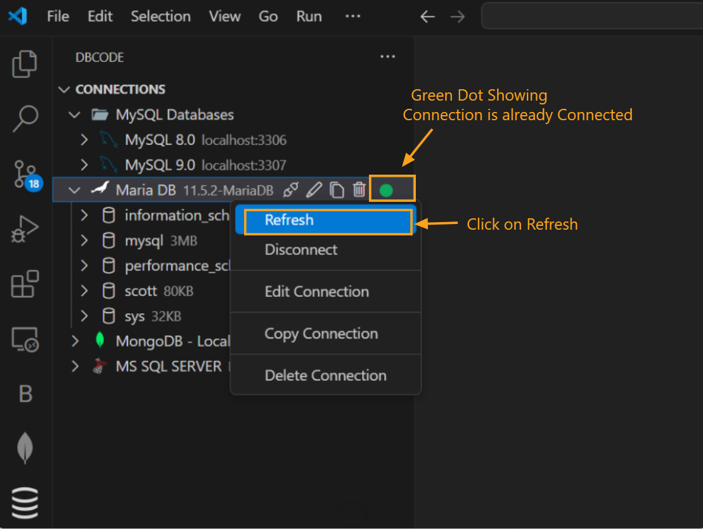

---

title: Refresh

description: Refresh your database connection in DBCode to load the latest data, tables, and structure changes without needing to reconnect.

order: 4

---

## Refreshing a Database Connection

1. **Open DBCode in Visual Studio Code:**
   - Launch Visual Studio Code and click on the DBCode icon in the Activity Bar (usually on the left side).

   

2. **Locate Your Connected Database:**
   - In the DBCode explorer, find the connection you want to refresh. Make sure it’s already connected (indicated by a green dot next to the connection name).

3. **Refresh the Connection:**
   - Right-click on the connected database and select **Refresh** from the context menu.

   

4. **Load the Latest Data and Structure:**
   - DBCode will refresh the connection, updating the list of tables, views, and any new or modified database objects.
   - This is useful if changes have been made to the database structure or data by other users or processes.

5. **Confirmation:**
   - Once refreshed, you will see an updated list of tables and other objects, ensuring you’re working with the most current version of the database.

## When to Use Refresh

- **Data or Structure Updates:** Use refresh whenever new tables, columns, or data have been added to or modified in the database.
- **Sync Changes from Other Users:** Refresh to see changes made by other users if you’re collaborating on the same database.

---

Refreshing your database connection in DBCode helps ensure you’re always working with the latest database objects and data, without needing to disconnect and reconnect.