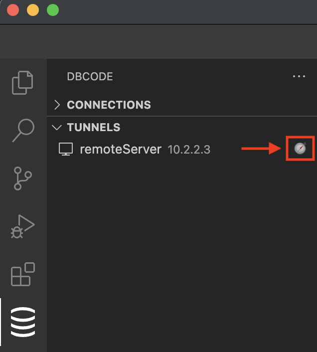
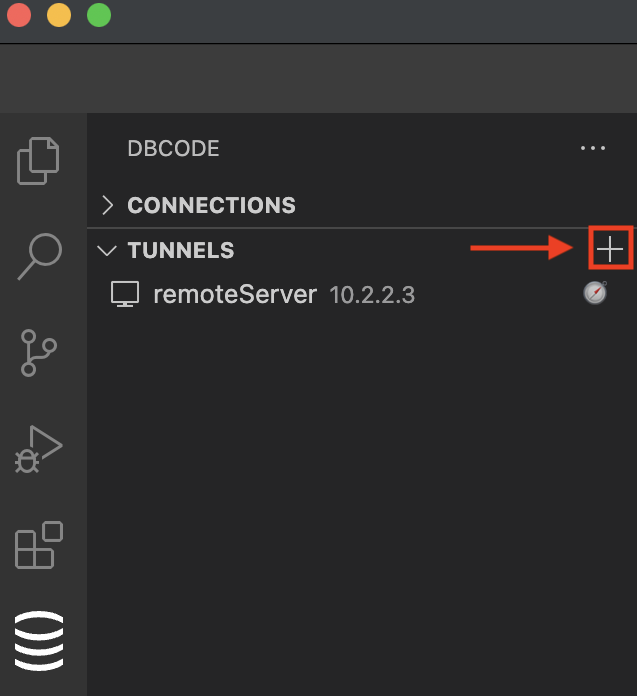
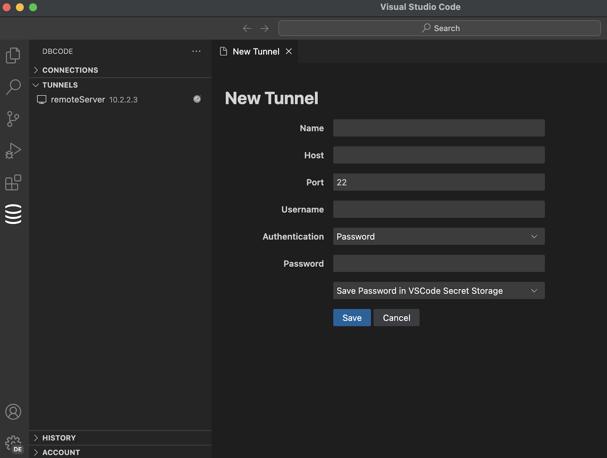
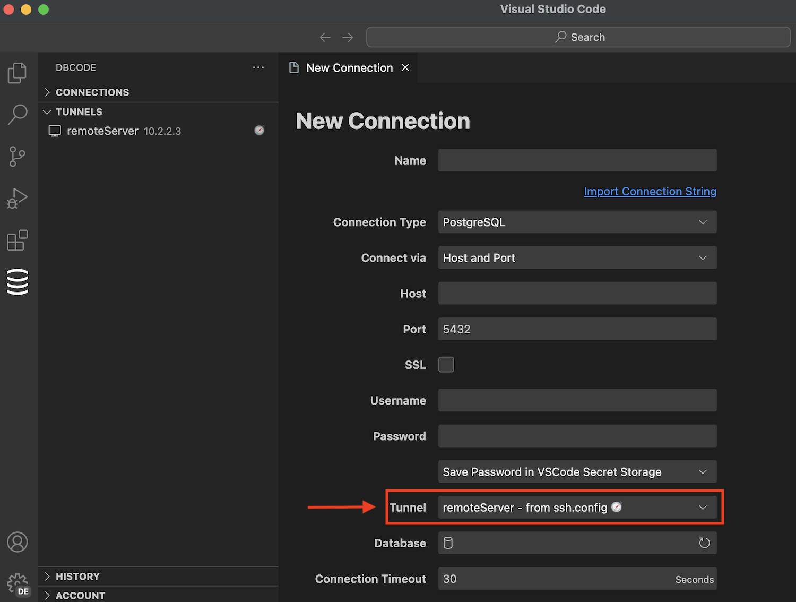
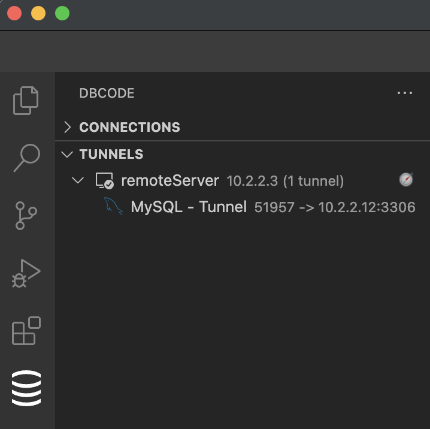

This guide will walk you through the process of setting up SSH tunnel configurations, which can either be automatically discovered or manually created. 

Once configured, these tunnels can be used when connecting to a database.

## Automatic SSH Tunnels

DBCode can automatically discover SSH tunnel configurations from your system's SSH config file. 

If you have existing configurations, they will be automatically detected and displayed in the Tunnels section of the DBCode Explorer with a compass icon (🧭)

## Manually SSH Tunnels

If you prefer to manually create SSH tunnel configurations, follow the steps below. 

Manual configurations allow for flexible authentication options, including username/password, SSH agent, or key-based authentication.

### Add
Click the + icon in the Tunnels section of the DBCode Explorer

### Configure
- **Name**: Enter the name for the tunnel.
- **Host**: Enter the hostname or IP address of the remote server.
- **Port**: Specify the port to use for the SSH connection (default is usually 22).
- **Username**: Enter the username for the SSH connection.
- **Authentication Method**:
	- **Username/Password**: Provide the password associated with the username.
	- **SSH Agent**: Use the SSH agent running on your system to manage keys.
	- **Key-Based Authentication**: Specify the path to your private key file, and optional password.

### Save

Save the newly created SSH tunnel configuration by clicking the Save button.

## Using Tunnels

Once you have your SSH tunnel configurations set up, either automatically or manually created, you can use it to connect to your databases. 

To use a tunnel for a database, you can create a new connection, or edit an existing one, and select the tunnel from the Tunnels drop down list. 

## Active Tunnels

When the tunnel is in use, it will show the databases using the tunnel and the IP addresses and ports being mapped for each database.

