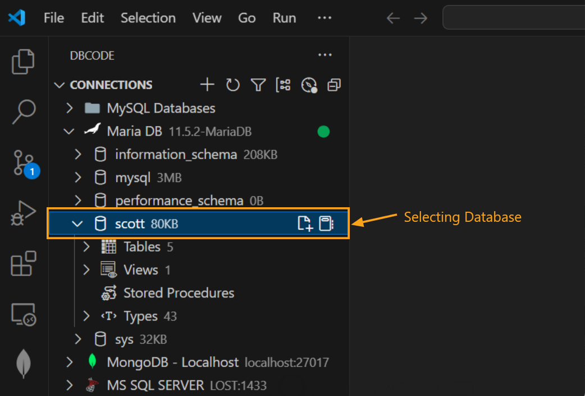
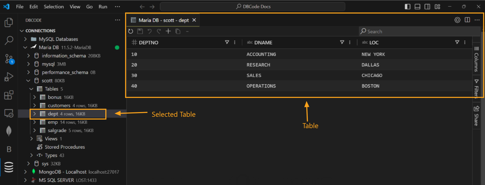
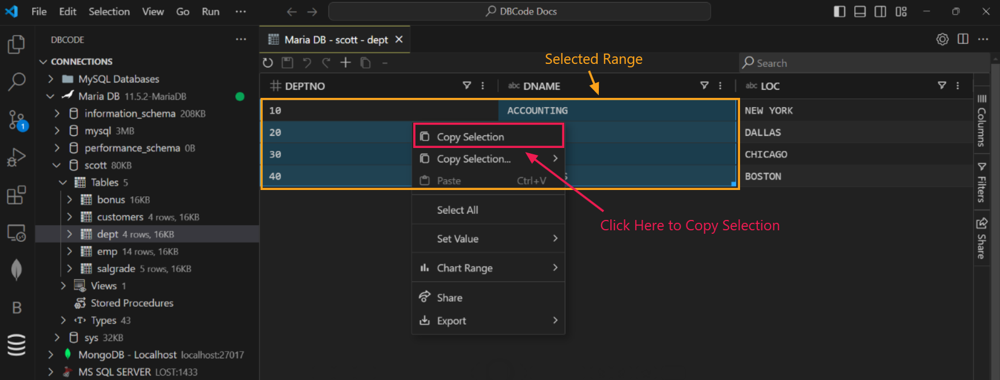
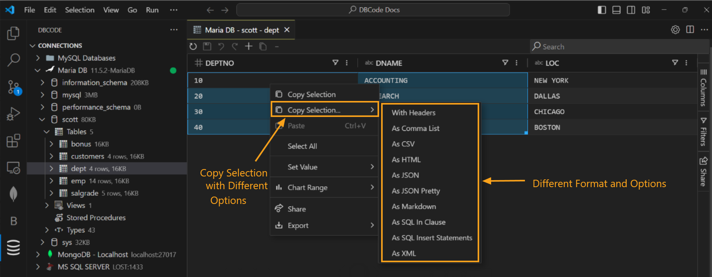
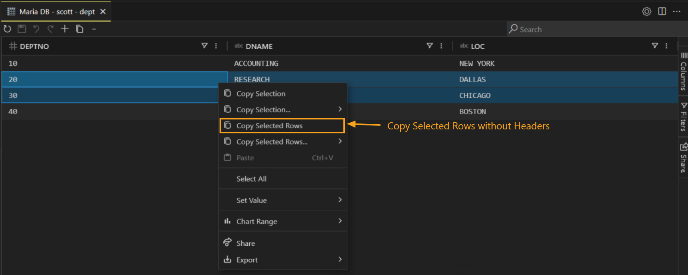
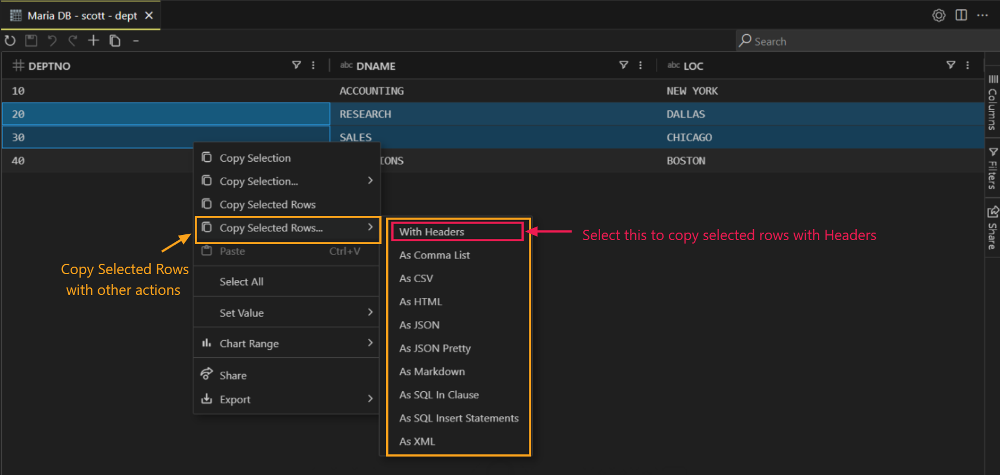

## How to Copy Table Data

### Opening a Table

1. **Connect to Database**: Start by opening a connection from the `DB Explorer` pane.
   
   

2. **Select a Database**: After selecting a connection, choose a specific database.

   

3. **Open a Table**: Expand `Tables` by double-clicking, then click on a specific table. This will open the table in a new tab.

   

### Copying Data Without Headers

1. **Select Data Range**: To select rows or columns for copying, click and drag over the cells with your mouse. Alternatively, you can select the entire table by right-clicking anywhere on the table and choosing `Select All` from the context menu.

2. **Right-Click and Copy**: Right-click the selection to open the context menu, then select `Copy Selection` to copy the data **without headers**.

   

### Copying Data With Headers

1. **Repeat Selection Process**: As before, select the range of data.
2. **Copy with Headers**: Right-click, select `Copy Selection`, then choose `With Headers` from the submenu as shown below to include headers in your copied data.

   

### Copying Selected Rows Without Headers

1. **Select Rows**: Hold down the `Ctrl` key and click on each row you want to select. This allows you to choose specific rows from the table for copying.
2. **Copy Selected Rows**: Right-click the selected rows and choose `Copy Selected Rows` from the context menu to copy them **without headers**.

   

### Copying Selected Rows With Headers

1. **Repeat Row Selection**: Highlight the rows you want to copy.
2. **Copy Rows with Headers**: Right-click, select `Copy Selected Rows`, then choose `With Headers` from the submenu as shown below. 

   

---

### Available Copy Formats

You can copy data from the table in the following formats:

- **With Headers**: Copies the data along with column headers.
- **As Comma List**: Copies the selected values as a comma-separated list.
- **As CSV (Comma-Separated Values)**: Ideal for use in spreadsheets and data analysis tools.
- **As HTML**: Copies data in HTML table format, suitable for embedding in web pages.
- **As JSON**: Exports data as JSON, useful for web development and APIs.
- **As JSON Pretty**: Similar to JSON but formatted for better readability.
- **As Markdown**: Copies data in Markdown table format for documentation and markdown editors.
- **As SQL In Clause**: Formats data for use in SQL `IN` clauses, helpful in database queries.
- **As SQL Insert Statements**: Copies data as SQL `INSERT` statements to easily insert data into databases.
- **As XML**: Exports data in XML format, commonly used for structured data exchange.

These options are available when you select "Copy Selection" or "Copy Selected Rows" and choose the desired format from the submenu. Select the format that best suits your task.
