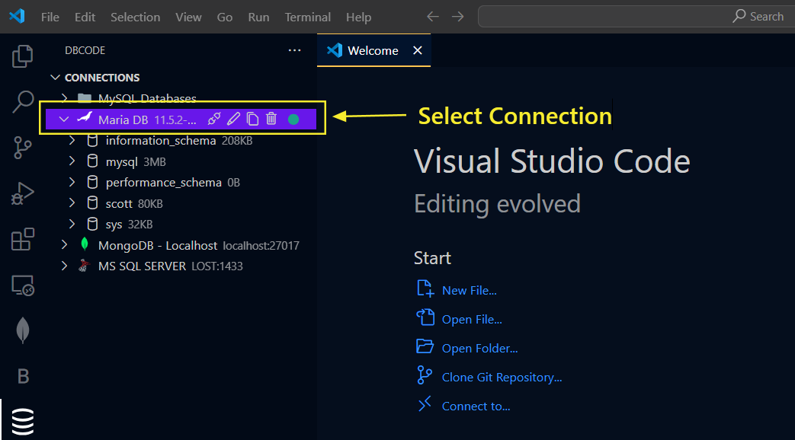
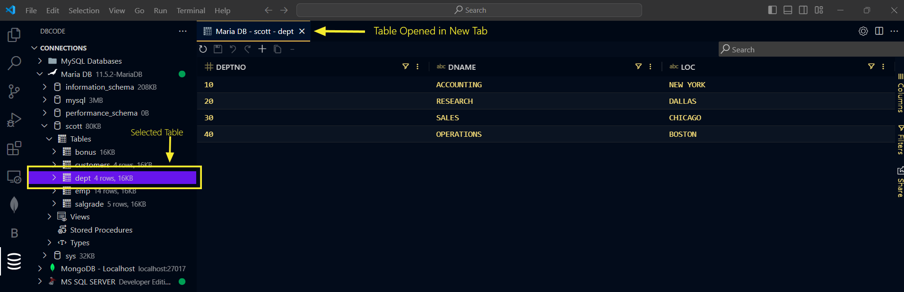
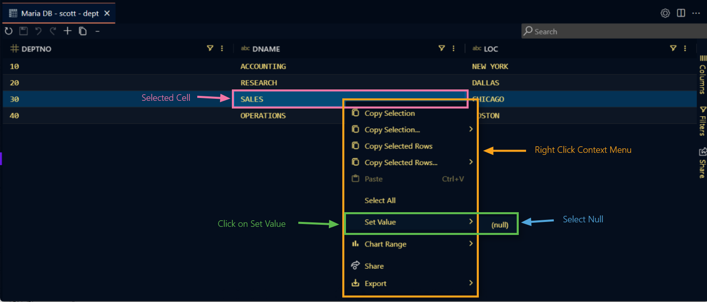
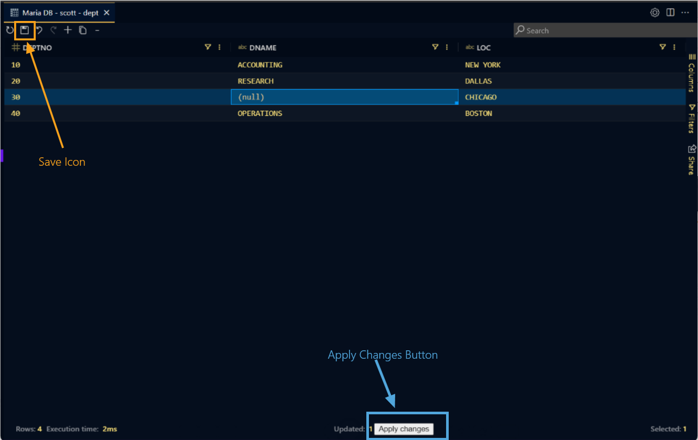
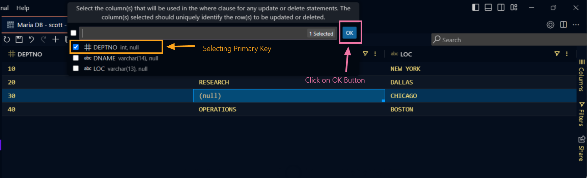

## How to Edit Table Data

### Opening a Table

To select a table, begin by opening a connection from the `DB Explorer` pane.

After selecting Connection, select a `Database`.

Now expand `Tables` by double clicking and click on specific table. This will open that specific table in a new tab.

### Editing Data

To edit the data, double click on a cell to open the editor and enter the value you want to set.

To update a value to NULL, simply enter `(null)` in the cell, or right click and select `Set Value` > `null` if the column is nullable.

### Applying Changes

After making changes, click on `Apply Changes` button or `Save` icon in the toolbar.

If a primary key is not present on the table, a prompt appears to select `Column with Unique Value` to ensure changes are matched to unique rows in your data.

