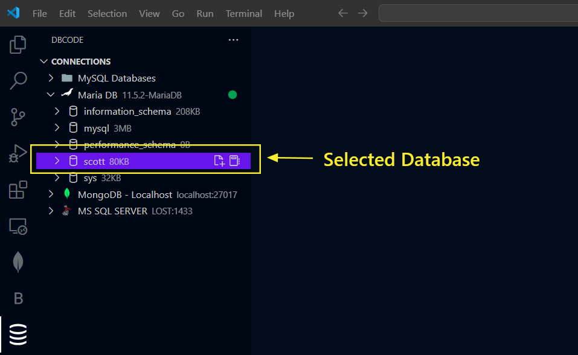

## How to Edit Table Data

### Opening a Table

To select a table, begin by opening a connection from the `DB Explorer` pane.

After selecting Connection, select a `Database`.

Now expand `Tables` by double clicking and click on specific table. This will open that specific table in a new tab.

### Editing Data

To edit the data, double click on a cell to open the editor and enter the value you want to set.

To update a value to NULL, simply enter `(null)` in the cell, or right click and select `Set Value` > `null` if the column is nullable.

### Applying Changes

After making changes, click on `Apply Changes` button or `Save` icon in the toolbar.

If a primary key is not present on the table, a prompt appears to select `Column with Unique Value` to ensure changes are matched to unique rows in your data.

### Verifying Changes

The paid editions of DBCode automatically validate update or delete operations before executing them on the database. This step is crucial to ensure that changes affect only the intended data.

During the validation process, each row with an update or deletion is checked to confirm that only one unique row in the table is affected. If validation fails, the changes are not applied, and an error notification is provided.

In contrast, the free edition does not include this verification step. Users of the free edition must acknowledge this before proceeding with any changes.