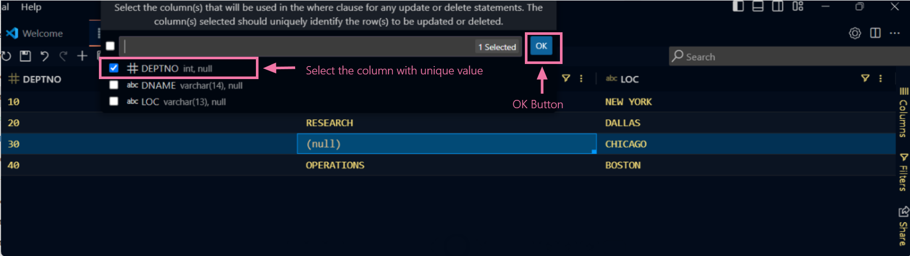

## How to Edit Table Data

### Step 1 - Selecting Specific Table

To select specific table , first of all you need select a perticular connection from `Connections` pane.

After selecting Connection , select perticular `Database`  by double clicking from which you want to edit table data.

Now expand `Tables` by double clicking and click on specific table. This will open that specific table in a new tab.

### Step 2 - Editing cell values

To edit the cell value of specific column in opened table , hover the mouse over that specific cell and select that by single click.

So there are two types of editing is available  :-

- **Setting Null Value in any specific Column**

To set null value to any cell in the specific column , right click on that specific cell and hover the mouse over `Set Value` and select `null`

After changing the value to null you will have to click on either on `Apply Changes button` or `Save` icon in the table header.

Then select `Primary key` of the table and Click `OK` to save changes successfully in the database.

Another method to set null value, by double clicking on the specific cell and entering manually `(null)` in that cell. To save changes follow the previous step by clicking on `Apply Changes` button.

- **Setting any Value in specific Cell**

Just Like entering null value manually in the specific cell , you can enter any value to that selected cell by double clicking on that.
