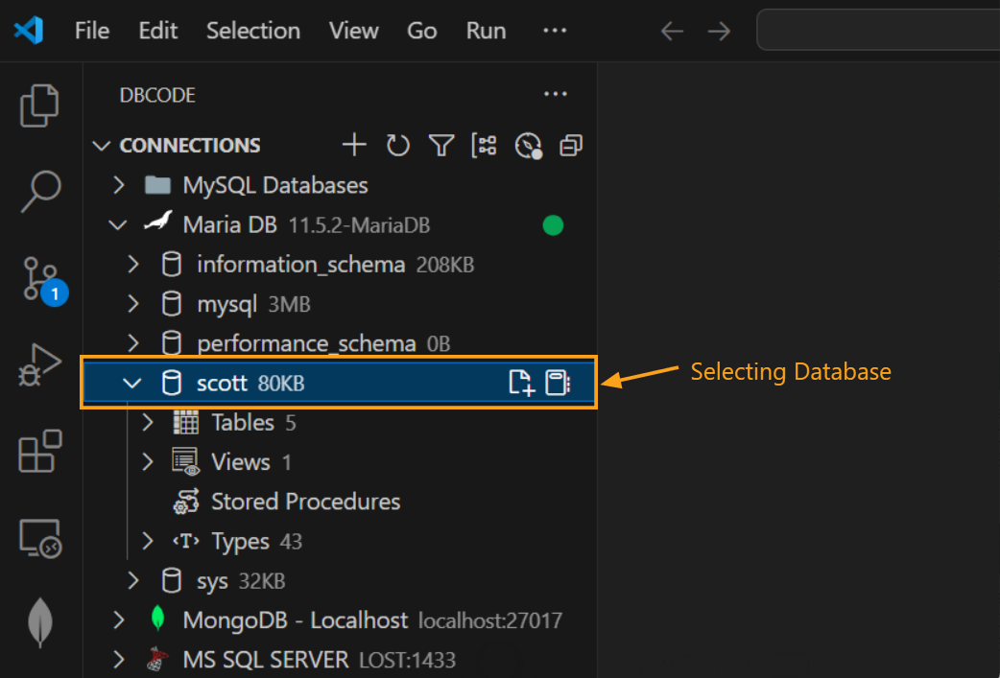
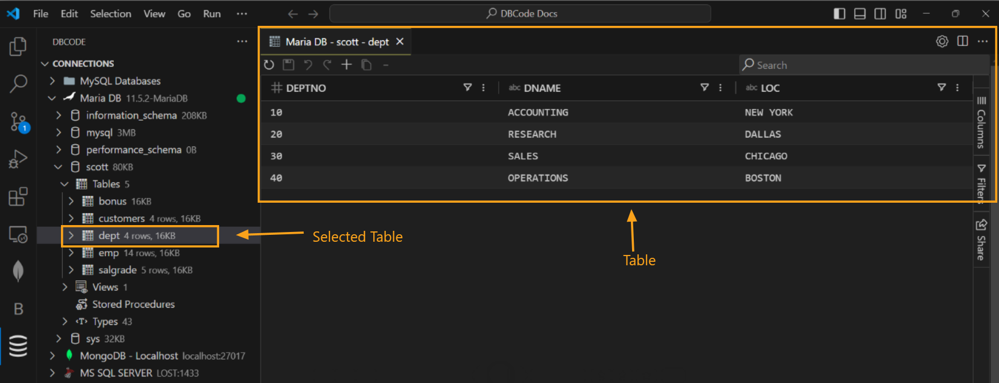
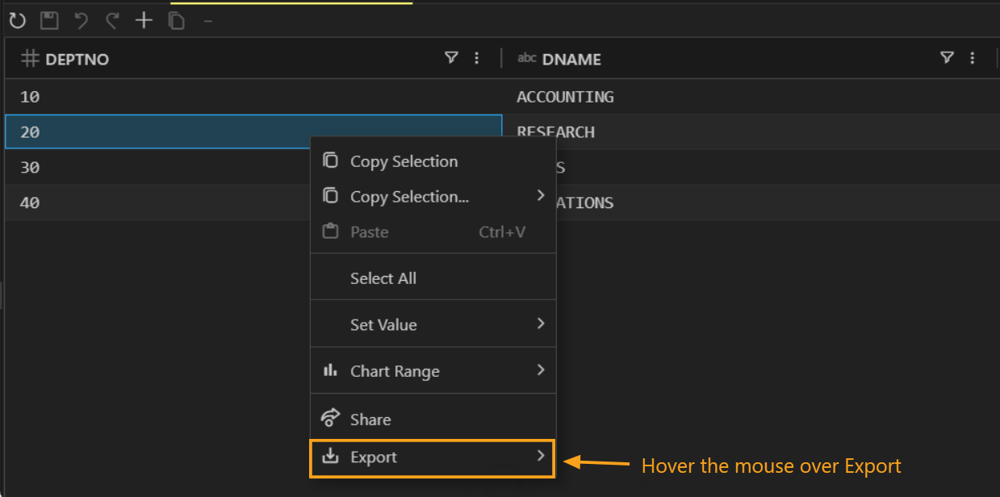
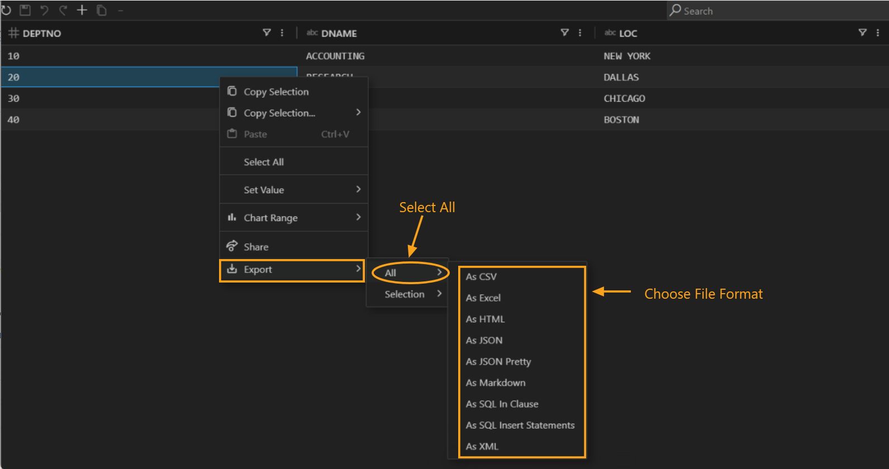
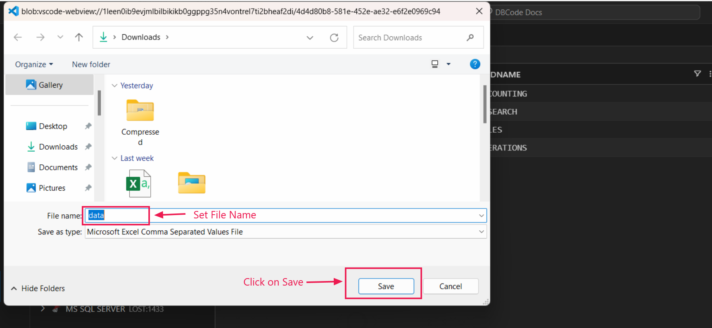
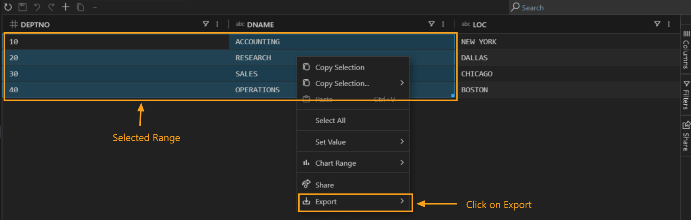
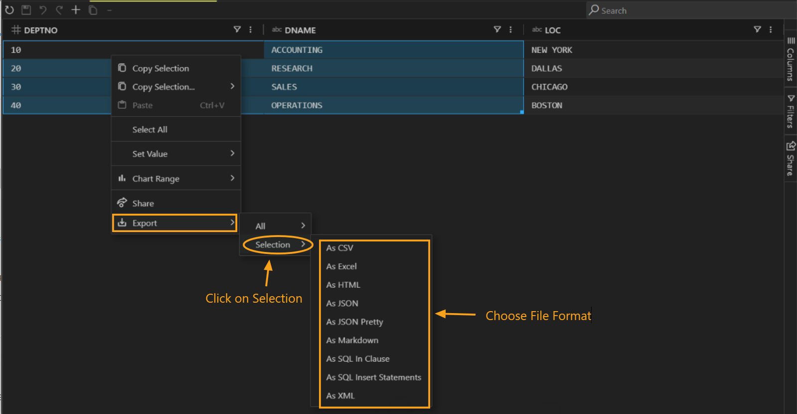

## Exporting Table Data

### Opening a Table

**Step 1: Connect to Database**  
Start by establishing a connection in the `DB Explorer` pane.

   

**Step 2: Select a Database**  
After connecting, choose the desired database.

   

**Step 3: Open a Table**  
Expand the `Tables` section, double-click to expand, and click on the specific table you want. This will open it in a new tab.

   

---

### Exporting Entire Table Data

1. **Right-Click on the Table**  
   Hover over the table, right-click to open a context menu, then hover over `Export`.

   

2. **Select `All`**  
   In the submenu, choose `All`, then select your preferred file format.

   

3. **Save the File**  
   Choose a location, name the file, and click **Save**.

   

---

### Exporting Selected Range Only

1. **Select the Range**  
   Highlight the desired range of data in the table, then right-click to open the context menu and choose `Export`.

   

2. **Choose `Selection`**  
   From the submenu, select `Selection`, then choose your preferred file format.

   

3. **Save the File**  
   Specify a location, set a file name, and click **Save**.

   

---

### Supported Export Formats

You can export table data in a range of formats, including:

- **CSV** (Comma-Separated Values)
- **Excel** (XLSX)
- **HTML**
- **JSON** (JavaScript Object Notation)
- **JSON Pretty** (Formatted JSON for readability)
- **Markdown** (For documentation purposes)
- **SQL In Clause** (SQL format for use in `IN` conditions)
- **SQL Insert Statements** (SQL script for re-inserting data)
- **XML** (Extensible Markup Language)

These formats are available for both full table exports and selected data ranges, offering flexibility based on your requirements.