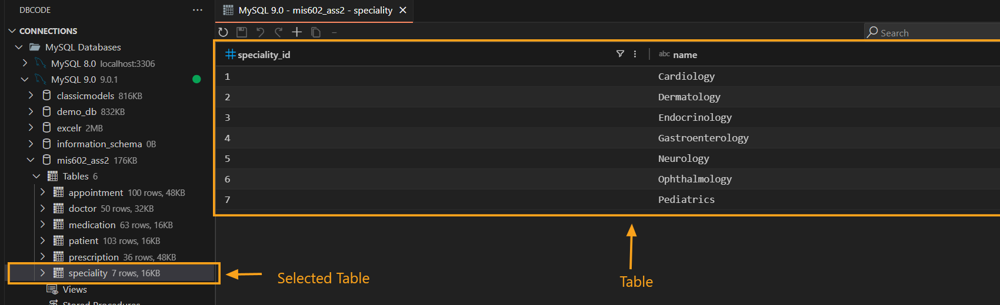
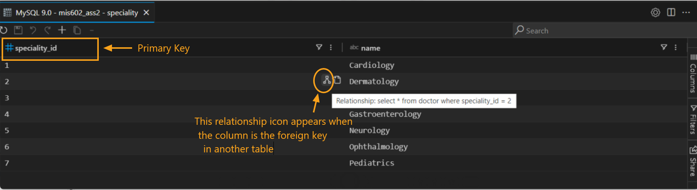
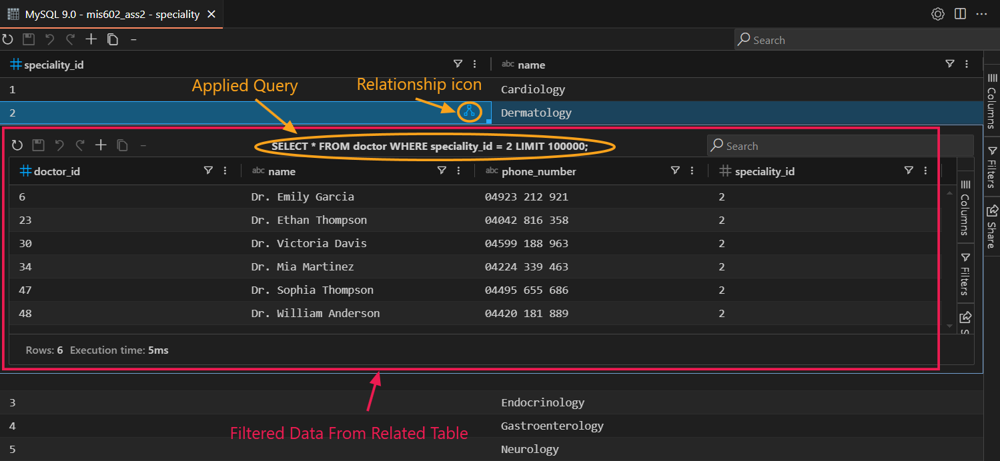

## Filtering Related Data in Linked Tables

### Open a Table

1. Begin by selecting a database connection from the DB Explorer.
2. Choose the desired database, then select a table by clicking it.

   

### Identify Linked Relationships

To understand the relationships between tables, hover over a cell containing a Primary Key or Foreign Key. A small relationship icon will appear beside the cell, indicating that the column is linked to another table.

   

### Browsing Foreign Key Relationships

Foreign key relationships allow you to navigate data across multiple tables in both directions:

- **From Foreign Key to Primary Key**: When you click on the relationship icon next to a foreign key, you can view the related records in the primary key table. For example, clicking on a `CustomerID` in an `Orders` table will show you all orders related to that specific customer in the `Customers` table.

- **From Primary Key to Foreign Key**: Conversely, while in the related table (e.g., `Customers`), you can explore how many orders each customer has by following the foreign key back to the `Orders` table.

### View Filtered Related Data

To see the linked data:

1. Hover over the relationship icon to view the message displaying the filtering query for the related table.
2. Click the relationship icon to instantly filter and display data from the related table, as shown below.

   

This two-way navigation of foreign key relationships enhances your ability to analyze data comprehensively, allowing for deeper insights and better data integrity.
