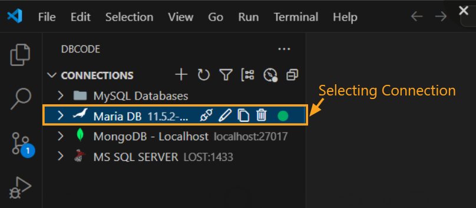
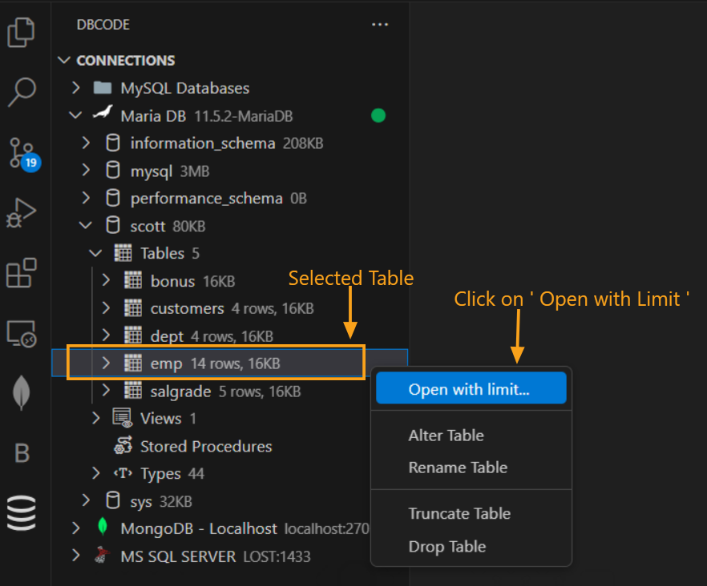
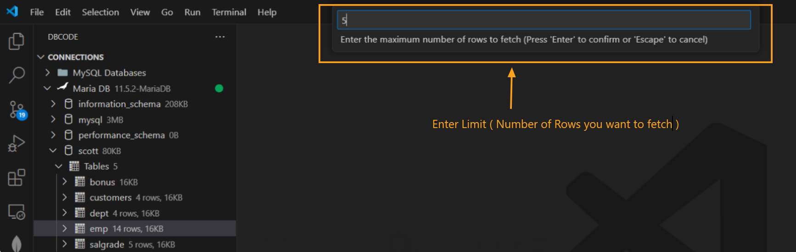
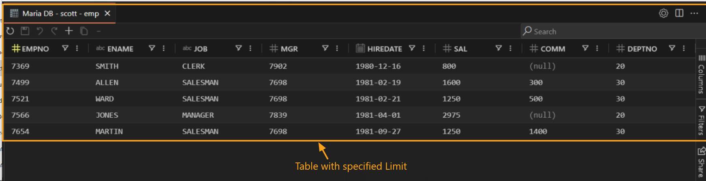

## Opening a Table with a Row Limit without SQL

### Select a Connection

In the `DB Explorer` pane, begin by selecting a database connection.

   

### Choose a Database

After selecting connection, select the desired database from the list.

   

### Locate and Select a Table

Expand the `Tables` section, then hover over the table you want to view. 

### Open the Table with a Row Limit

Right-click on the selected table and choose `Open with Limit` from the context menu as shown below.

 

### Specify Row Limit

There is a default limit of `100,000` rows, but you can adjust it as needed to fetch the desired number of rows. Once you’ve made your selection, press `Enter`.

 

The table will open in a new tab with only the specified number of rows displayed.

 

