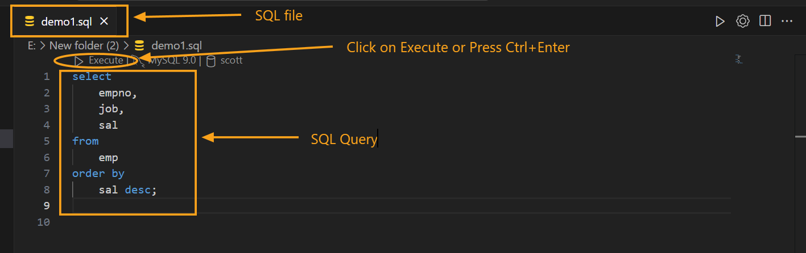
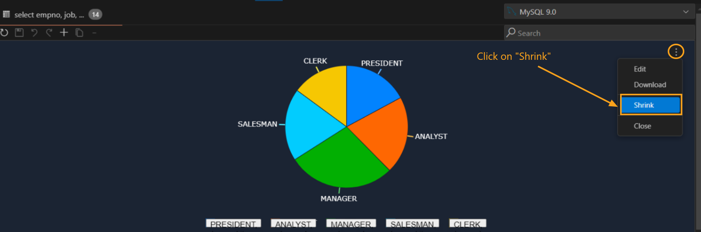

---

title: Chart  
description: Leverage DBCode to visualize query results using various chart types like bar charts, line charts, and pie charts, enhancing data interpretation within Visual Studio Code.  
order: 5  

---

## Chart Visualization in DBCode  

DBCode empowers users to visualize query results with charts, enabling better insights and efficient analysis. With support for various chart types, such as bar charts, line charts, and pie charts, DBCode integrates visualization into your workflow seamlessly within Visual Studio Code.  

---

### Enabling Chart Visualization  

1. **Run a Query**  
- Open a `.sql` file in **DBCode Notebook** or **SQL Editor** and execute your SQL query.  

- For detailed guidance, refer to [SQL Editor Documentation](/docs/query/sql-editor) and [Notebooks Documentation](/docs/query/notebooks).  

   

2. **View Results**  
- In the **SQL Editor**, results appear in the Results Pane at the bottom.  

- In **DBCode Notebook**, results are displayed in the output area of the respective code cell.  

   

---

### Creating a Chart  

DBCode offers two methods to create charts:  

#### **Method 1: Using Range Selection**  

1. **Select Data**  
   - Highlight the desired **Columns** or **Number of Rows** in the Results Pane by clicking and dragging.  

   

   - Alternatively, you can select the desired columns from `Columns` tab and set the `Row Groups` and `Values` by dragging desired columns to that fields. Then proceed to create `Chart Range`.

2. **Create the Chart**
   - Right-click on the selection, hover over **Chart Range** in the context menu, and select the chart type (e.g., bar chart, line chart, pie chart).  

   

3. **Edit the Chart**  
   - Click on the three dots at the top-right corner of the chart and select **Edit**.  
   
   

   - Configure settings across the following tabs:  
     - **Chart**: Change the chart type and style.  

   

     - **Set Up**: Define categories, series, and aggregation types.  

   

     - **Customize**: Adjust styles, titles, legends, and axis labels.  

   

#### **Method 2: Using Pivot Mode**  

1. **Enable Pivot Mode**  
   - Toggle **Pivot Mode** in the `Columns` tab of the output results pane.  

2. **Drag and Drop Columns**  
   - **Row Groups**: Add columns to group data by categories.  
   - **Values**: Add columns to display series; aggregate using functions like SUM, COUNT, AVG, MAX, etc.  
   - **Column Labels**: Use this to group series data across multiple columns for comparison.  

   

3. **Create the Chart**  
   - Right-click in the output result, hover over **Pivot Chart**, and select the desired chart type.  

   

4. **Edit the Chart**  
   - Access the **Edit** menu (three dots in the top-right corner) to refine the chart using tabs like **Chart** and **Customize**.

   

---

### Chart Customization  

#### **Customize Tab Features**  

1. **Chart Style**  
   - Adjust padding and background color.  

2. **Titles**  
   - Define the chart title, subtitle, and axis titles.  

3. **Legend**  
   - Enable or disable legends and set their position.  

4. **Series**  
   - Configure series styles, tooltips, opacity, labels, and shadows.  

5. **Horizontal Axis**  
   - Set position, color, grid lines, ticks, and labels.  

6. **Vertical Axis**  
   - Configure position, color, grid lines, ticks, and labels.  

---

### Supported Chart Types  

- **Column Chart**  
- **Bar Chart**: Compare data across categories.  
- **Line Chart**: Analyze trends over time.  
- **Pie Chart**: Display proportions of a whole.  
- **Scatter Plot**: Highlight relationships between variables.  
- **Area Chart**: Represent cumulative data trends.  
- **Hierarchical Chart**: Represent data hierarchies with expandable categories for better visualization of parent-child relationships.  
- **Combination Chart**: Combine multiple chart types (e.g., bar and line) to present complex data relationships in a single visualization.  

---

### Additional Features  

#### **Expanding or Shrinking Charts**  
- **Expand**: Click the three dots in the chart's top-right corner and select **Expand**.  

  

- **Shrink**: Repeat the process and select **Shrink**.  

  

#### **Using Filters**  
1. Click on the **Filters** tab in the query output pane.  

  

2. Apply filters using criteria like Contains, Equals, Blank, etc.  

  

3. The filtered data will automatically update the chart view.  

#### **Exporting Charts**  
1. Click the three dots in the chart's top-right corner and select **Download**.  

  

2. Specify the file name and location to save the chart as an image.  

  

#### **Closing Charts**  
- To remove a chart, click the three dots in its top-right corner and select **Close**.  

  

---

### Benefits of Chart Visualization  

- **Enhanced Insights**: Easily detect patterns and trends.  
- **Integrated Workflow**: Stay within Visual Studio Code for end-to-end analysis.  
- **Customizable Visuals**: Tailor charts to meet specific needs.  
- **Efficiency**: Toggle between table and chart views effortlessly.  

---

DBCode's chart visualization transforms raw query outputs into actionable insights, simplifying data analysis and enhancing workflows directly within Visual Studio Code.