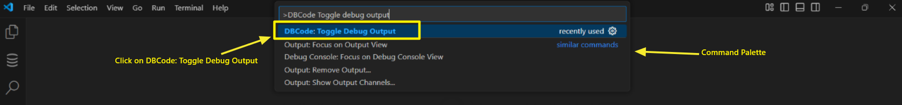
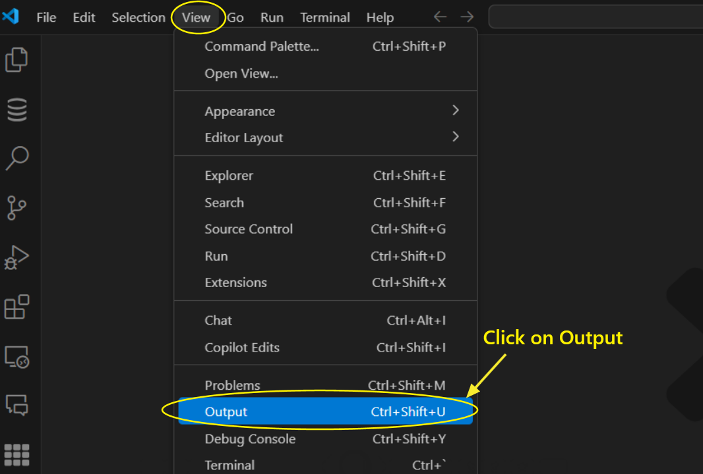
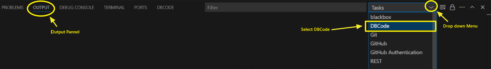
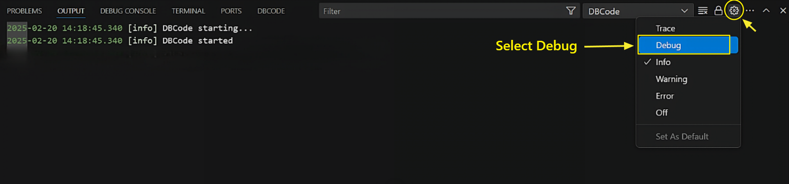
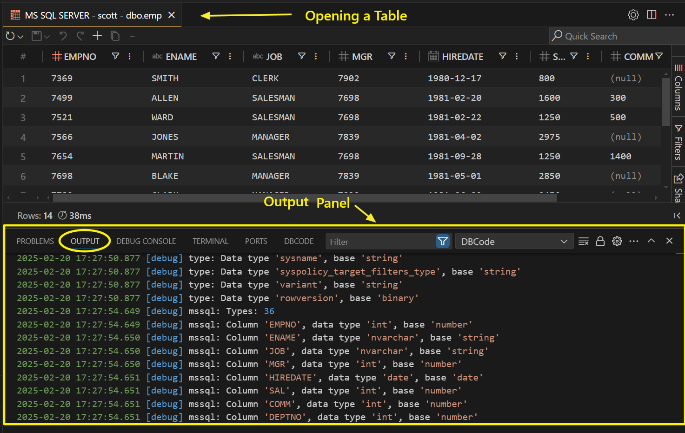
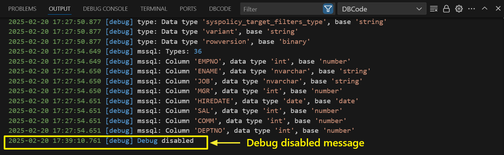

## Debug Feature in DBCode

The **Debug Feature** in DBCode provides detailed insights into query execution and column data type mappings, currently available only for **Microsoft SQL Server**. It helps troubleshoot queries by showing the base data type of each column, making it easier to identify inconsistencies.

### Enabling the Debug Feature

Follow these steps to enable debugging:

1. **Open Command Palette:**
   - In Visual Studio Code, press **Ctrl+Shift+P** (Windows) or **Cmd+Shift+P** (Mac).
   - Search for **DBCode: Toggle Debug Mode** and select it.

    

2. **Enable Output:**
   - Open the **Output** panel by navigating to **View > Output**.

    

   - From the drop-down menu, select **DBCode** to view debug logs.

    

   - Set the log level to `Debug` by clicking the settings-like icon in the header of the output panel labeled **Set Log Level**.

    

> **Note:** Debug mode will automatically stop after **30 minutes** of inactivity to prevent excessive logging.

### Viewing Debug Output

- Once enabled, running a query or opening a table will generate detailed logs, as shown in the example below:

    

Key details include:
- **Column Name:** The field being processed.
- **Data Type:** The SQL Server data type of the column.
- **Base Type:** How DBCode interprets the column (e.g., `datetime`, `string`, `number`).

### Disabling the Debug Feature

To turn off debugging:
1. Open the **Command Palette**.
2. Search for **DBCode: Toggle Debug Mode** and select it again.

    

3. Once debugging is disabled, you'll receive a **Debug Disabled** message in the output panel.

    

Debugging will also automatically stop after **30 minutes** of inactivity.

### Best Practices

- **Monitor Actively:** Regularly check the output panel while debugging.
- **Stop Debugging:** To manually stop debugging, toggle the feature off via the Command Palette.
- **Review Mappings:** Ensure the **base type** aligns with your expectations, especially for date, time, and numeric fields.
