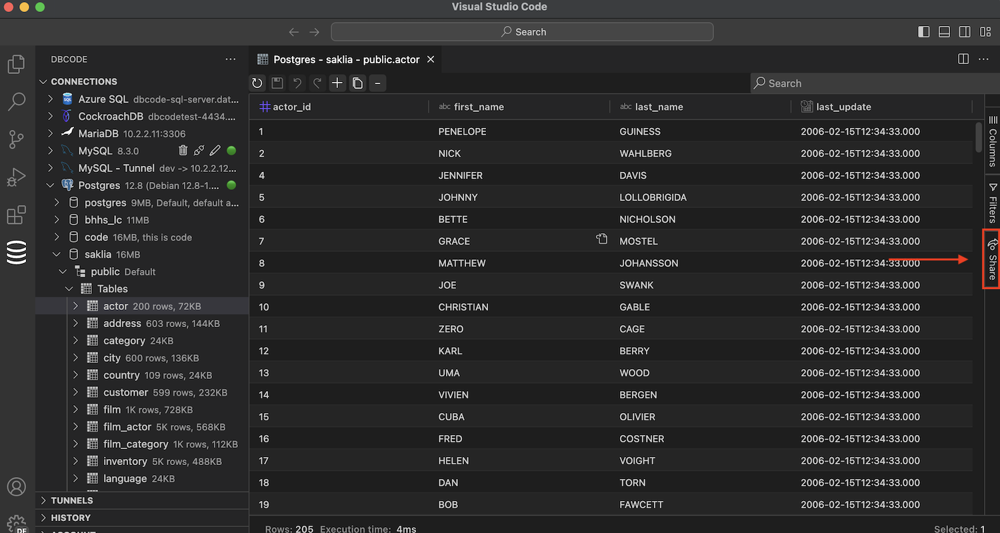
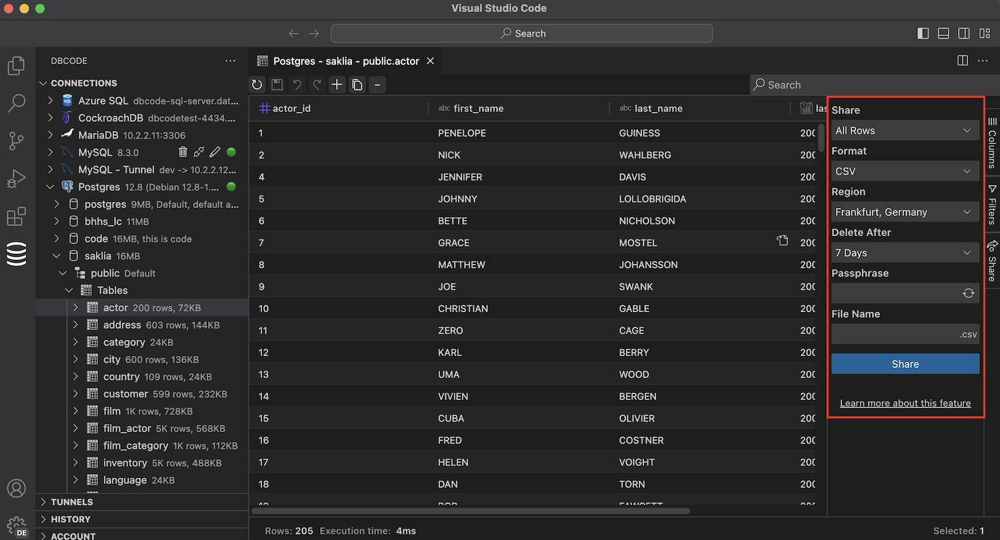
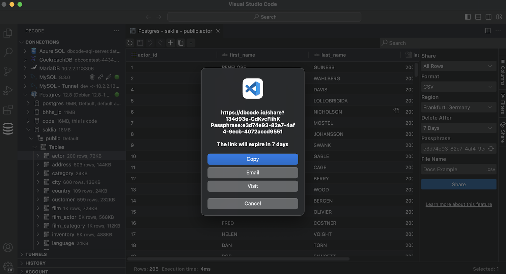

## Steps for Secure Sharing

### Run Your Query
Start by executing the query or opening the table whose data you want to share. 

### Open the Share Panel
Click the share icon on the right of the results table.

### Configure Options

1. **Report Format**:
Choose the format for your report from options such as CSV, Excel, HTML, and Markdown. This allows you to customize the report based on the preferences or requirements of your audience.

2. **Storage Region**:
For data compliance purposes, select the region where the report will be stored. This ensures that your data storage aligns with local regulations and standards.

3. **Delete After**:
Decide when the report should automatically expire and be deleted from storage. This step is crucial for managing data retention and ensuring that sensitive information is not accessible indefinitely.

4. **Passphrase**:
To enhance the security of your report, either enter a passphrase manually or have one randomly generated. This passphrase will be essential for decrypting the report later.

5. **Name**:
Give your data file a clear and identifiable name to make it recognizable for both you and the recipients.

### Share

Now click Share.

The report is now encrypted on your local computer before it is transmitted, safeguarding your data by ensuring it is locked and only accessible to those with the passphrase.

A download link for the report will be provided, along with options to copy, email or visit the link.

Share this link along with the passphrase with your intended recipients. 

## Downloading

When someone downloads the report, they will need to enter the passphrase to decrypt the data on their computer, maintaining the security of the information as it ensures that unencrypted data never travels over the network.

This process not only secures the data during transmission but also avoids leaving sensitive information in potentially insecure email inboxes or other less secure channels. 

By controlling both the encryption before transmission and decryption upon reception, and by setting an automatic expiration for the report, the system guarantees end-to-end security for sensitive information shared via reports.

## Technical Encryption Details

Here are the technical details of the encryption process used to secure data when sharing reports through our system:

### Client-Side Encryption
All cryptographic operations are performed client-side, using the browser's native cryptographic methods. This ensures that all encryption takes place on the user's computer, before the data is transmitted.

### Key Derivation
A cryptographic key is derived from the user-supplied passphrase. This process utilizes a random salt and the SHA-512 hashing algorithm. The key derivation is performed with the following parameters:
   - **Hash Algorithm**: SHA-512
   - **Key Length**: 256 bits
   - **Cipher**: AES-GCM
   - **Iterations**: 64,000

### Data Encryption
   - A random initialization vector (IV) is generated for each encryption process.
   - The derived key and IV are used to encrypt the data using the AES-GCM cipher. This mode of operation not only ensures confidentiality but also provides integrity and authenticity of the data.

### Uploading and Storage
   - The encrypted data, along with the random salt and IV, are securely uploaded to the server.
   - The data is stored until the chosen expiry date, after which it is automatically deleted.

This encryption approach ensures that your data remains confidential and secure throughout the sharing process, from the moment it is encrypted on your device until it is accessed by the recipient.
