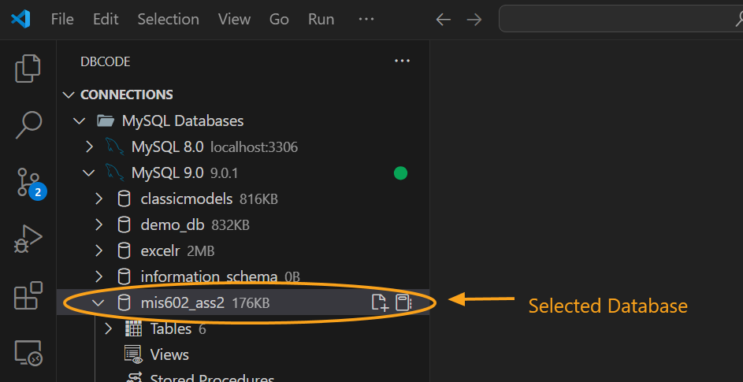
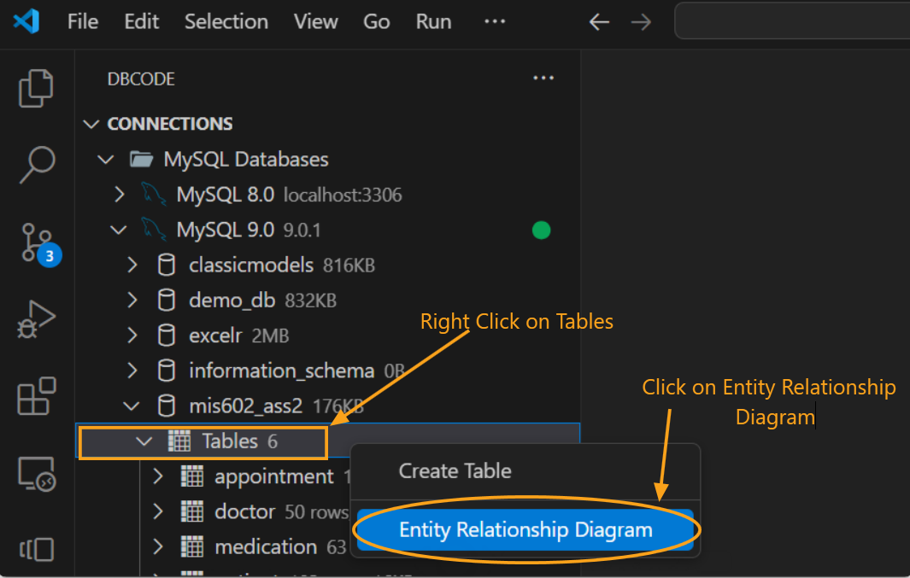
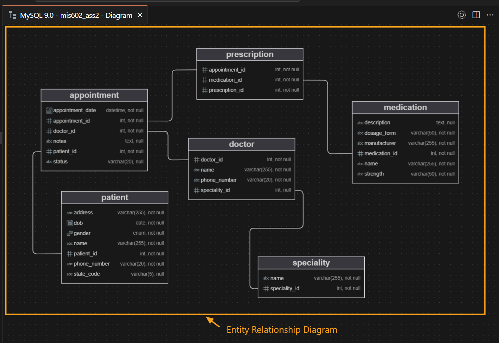

## How to View Entity Relationship Diagram

### Select a Database

1. Start by selecting a database connection from the **DB Explorer**.
2. Choose the desired database.

   

### Access the Entity Relationship Diagram

1. Hover over **Tables** in the database menu.
2. Right-click to open the context menu, then select **Entity Relationship Diagram**.

   

3. A new tab will open, displaying the Entity Relationship Diagram. You can adjust the layout of the diagram by dragging tables to reorganize the view.

   

