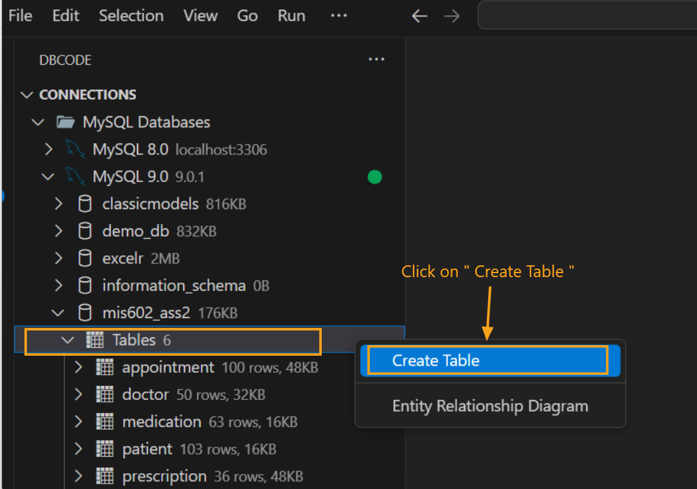
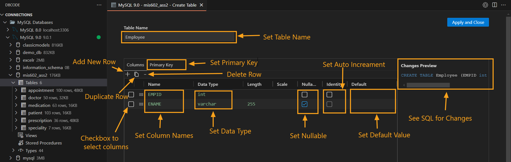
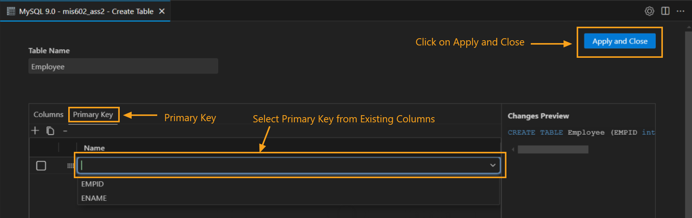
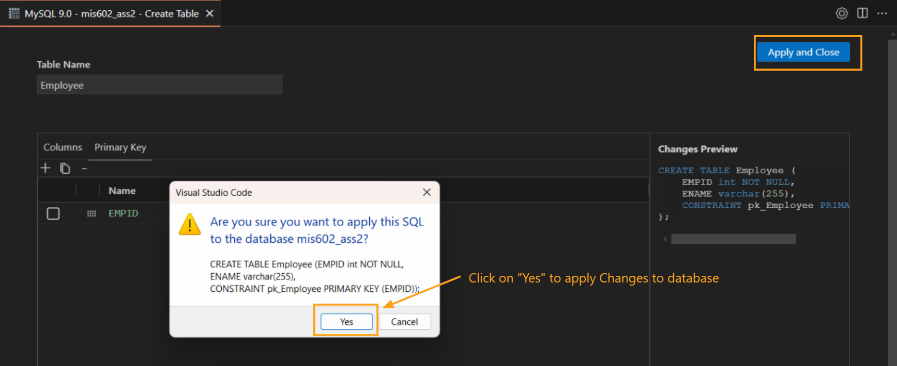
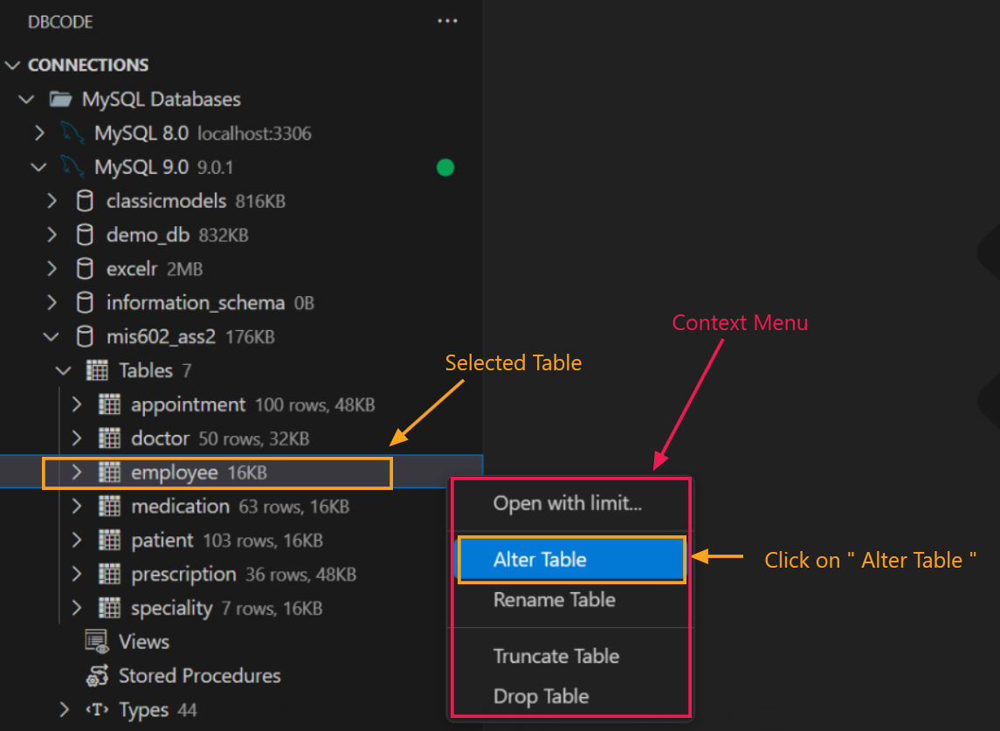
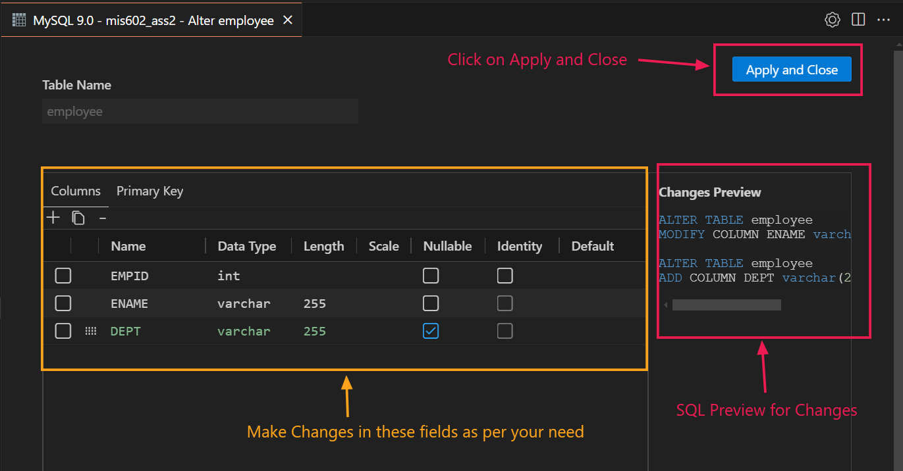

## Create or Edit Tables without SQL
A step-by-step guide on how to create or edit tables in a database without writing SQL.

### Creating a New Table

1. **Select the Database Connection**
   - Start by choosing a database connection from **DB Explorer**.

   - Select the desired database from the list.

   

2. **Open the Table Creation Menu**
   - Hover over **Tables** in the database menu, right-click, and choose **Create Table**.

   

3. **Define Table Structure**
   - A new tab will open where you can define your table’s structure. Start by setting a table name, then add columns by clicking the `+` icon.

   - For each column, specify:
     - Column Name
     - Data Type
     - Nullable option (optional)
     - Identity for auto-increment (optional)
     - Default Value (optional)

   

4. **Preview SQL Code**
   - Use the sidebar to preview the SQL code generated by your changes.

5. **Set Primary Key**
   - Switch to the **Primary Key** tab, select the column(s) you want as the primary key, and apply your choice.

   

6. **Apply Changes**
   - Click on **Apply and Close**. When prompted, confirm the changes by selecting **Yes**.

   

### Editing an Existing Table

1. **Select Table to Edit**
   - From the database tables list, right-click on the table you want to modify and select **Alter Table**.

   

2. **Modify Table Structure**
   - A new tab will open, allowing you to adjust the existing table structure. You can modify column details like data type, length, nullable status, identity, and default values.

   - To add new columns, click the `+` icon below the columns tab.

   

3. **Apply Changes**
   - Once done, click **Apply and Close** to confirm. A prompt will ask if you'd like to apply changes to the database. Click **Yes** to finalize.

   