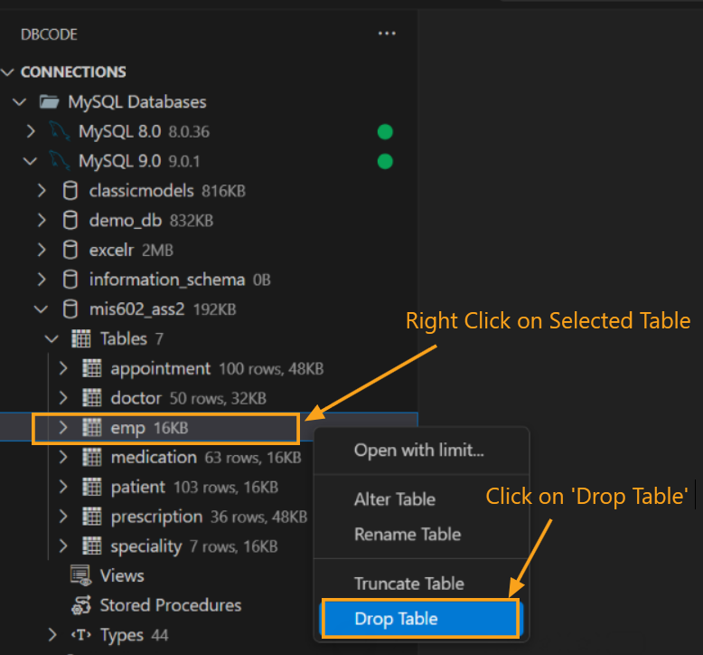
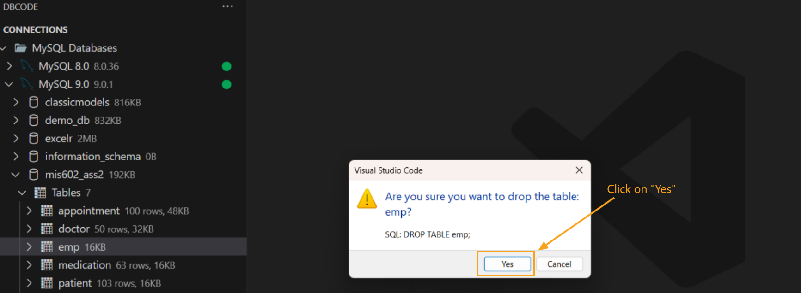
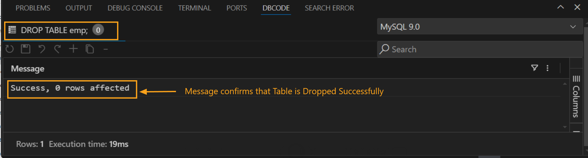

## How to Drop a Table Without Using SQL Commands

### Select Database Connection
   - In **DB Explorer**, connect to the database containing the table you want to drop.
   - From the list of databases, select the relevant one.

### Locate and Select the Table
   - Browse the tables in the selected database to find the table you wish to drop.
   - Right-click on the table name and select **Drop Table** from the context menu.

   

### Confirm the Drop Action
   - A confirmation dialog box will appear, asking you to confirm the action. Click **Yes** to proceed or **Cancel** to stop the operation.

   

### Verify Success
   - After confirming, a message in the **DB Code Panel** will indicate "Table dropped successfully," confirming the table has been deleted from the database.

   

This approach provides a user-friendly way to drop tables without writing SQL commands, helping reduce syntax errors and improving workflow efficiency.