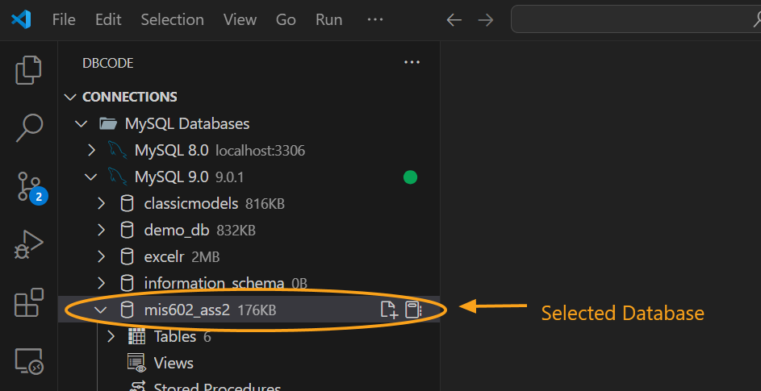
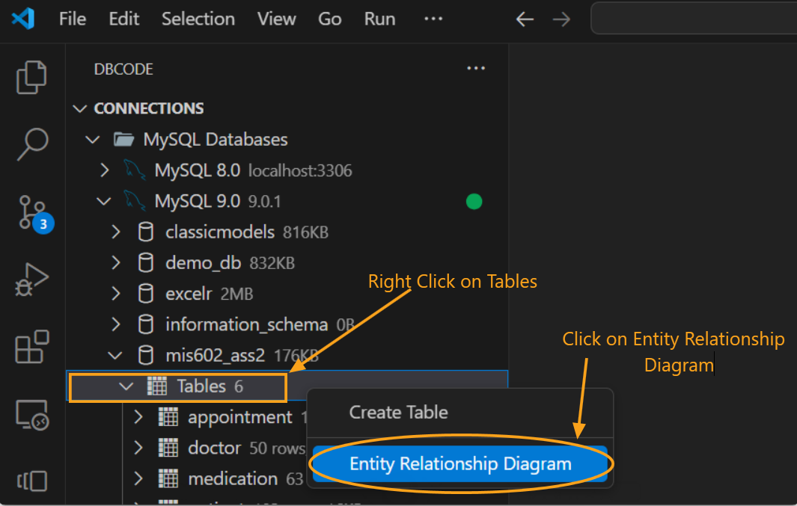
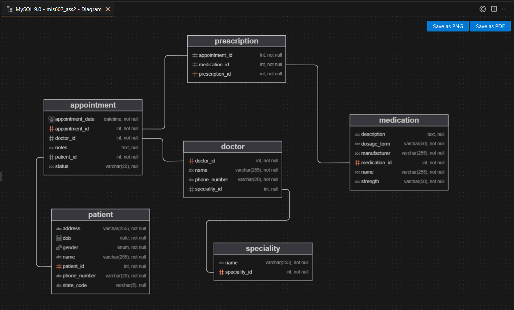
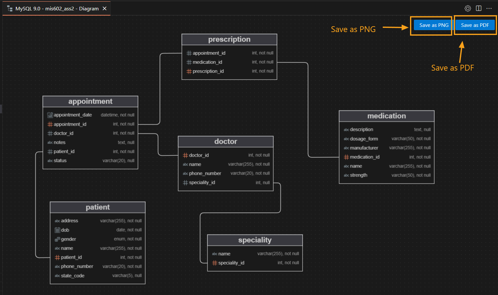
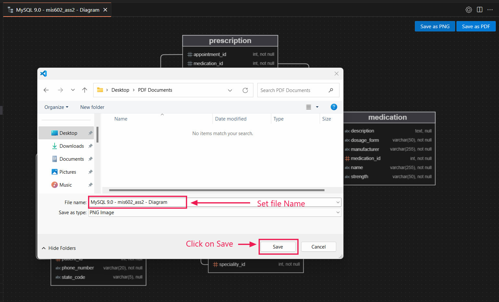

## How to View Entity Relationship Diagram

### Select a Database

1. Start by selecting a database connection from the **DB Explorer**.

2. Choose the desired database.

   

### Access the Entity Relationship Diagram

1. Hover over **Tables** in the database menu.

2. Right-click to open the context menu, then select **Entity Relationship Diagram**.

   

3. A new tab will open, displaying the Entity Relationship Diagram. You can adjust the layout of the diagram by dragging tables to reorganize the view.

   

### Save as PNG or PDF

1. Once the Entity Relationship Diagram is open, look for the **Save as PNG** and **Save as PDF** buttons on the top right corner of the diagram.

2. Click on either **Save as PNG** or **Save as PDF** as per your requirement.

   - **Save as PDF**: This will download a PDF version of the entire diagram, suitable for printing or sharing.

   - **Save as PNG**: This option will save the diagram as a high-resolution PNG image, which can be easily embedded into documents or presentations.

   

3. Select the desired location on your device to save the file, and click **Save**.

   

You now have your Entity Relationship Diagram saved in the preferred format for easy access and sharing.

