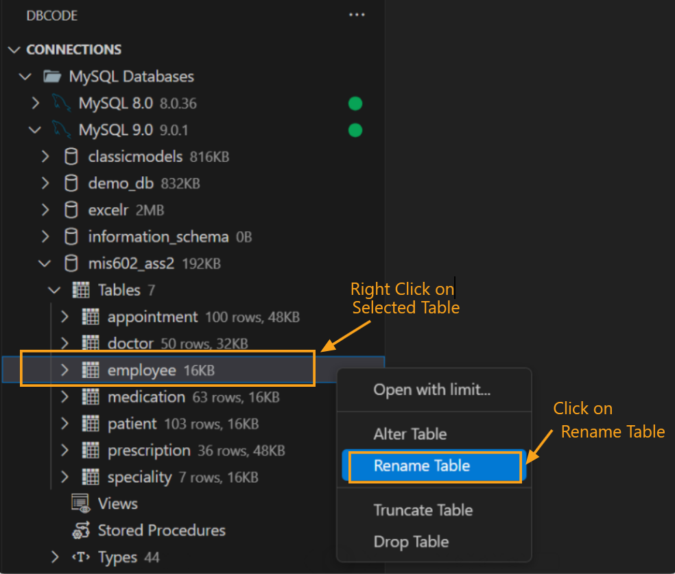
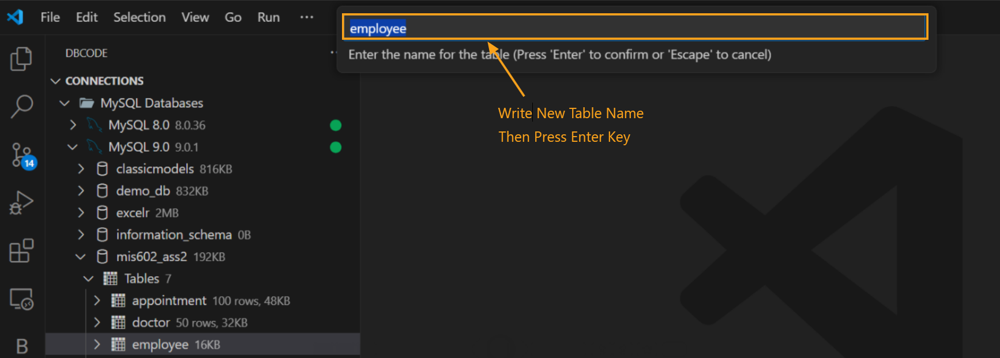
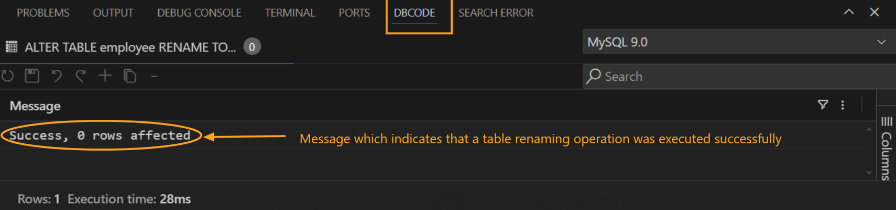

## Renaming a Table in Database Explorer

### Select Database Connection
   - From **DB Explorer** choose the database connection where the table is located.
   - From the list of available databases, select the desired one.

### Choose the Table to Rename
   - In the database tables list, locate the table you wish to rename.
   - Right-click on the table name and select **Rename Table**.

   

### Enter the New Table Name
   - An input box will appear at the top of the window, prompting you with "Enter the name of the table." 
   - Delete the current name, type the new name for the table, then press `Enter` to confirm or `Escape` to cancel.

   

### Confirm Successful Renaming
   - After pressing `Enter`, a message will display in the **DB Code Panel** at the bottom of the window: "Success, 0 rows affected," confirming the table has been renamed successfully.

   

This process ensures a quick and straightforward table renaming in your database, with clear feedback at each step.