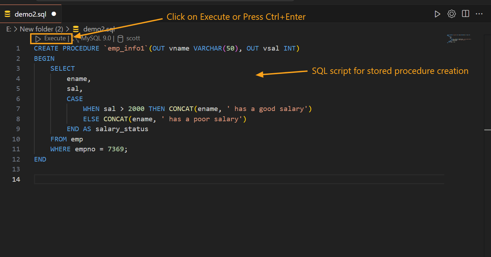
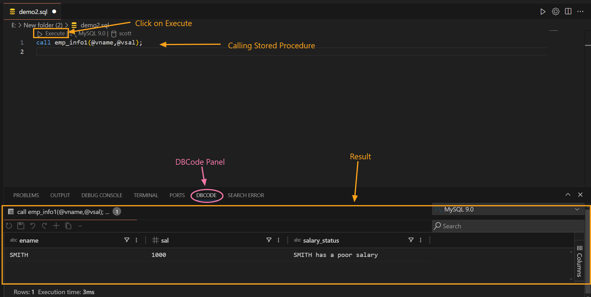
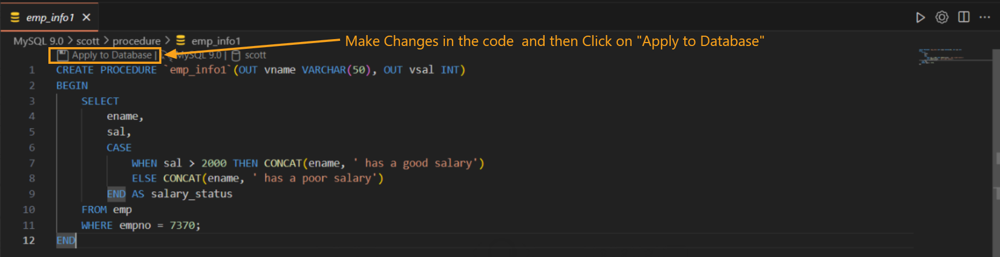
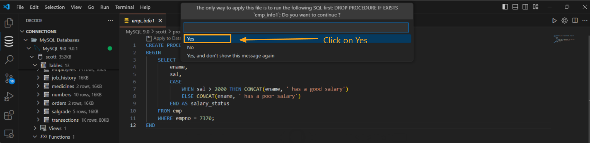
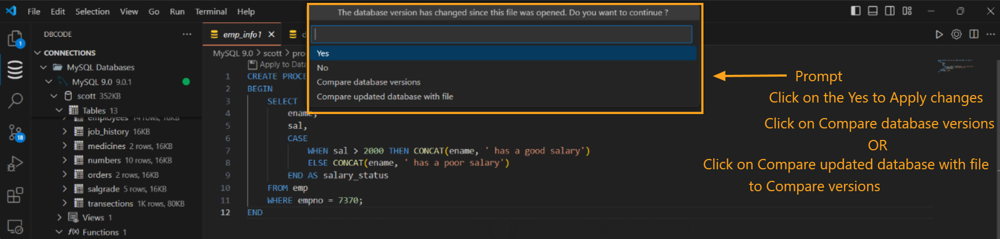
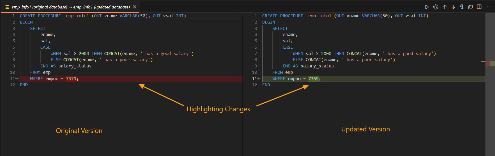
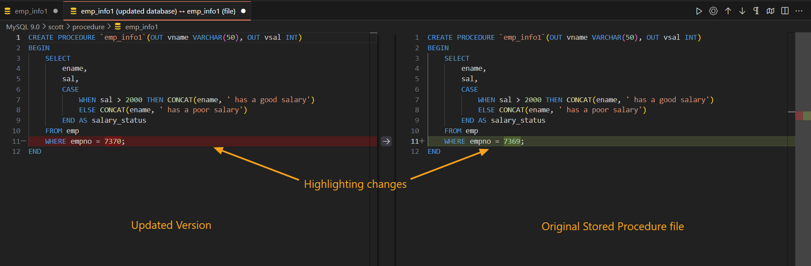

---

title: Stored Procedures  
description: Learn to create, execute, modify, and manage stored procedures in DBCode, including version conflict detection and comparison tools.  
order: 6 

---

## Stored Procedures in DBCode

Stored procedures are a vital tool for encapsulating reusable SQL logic. DBCode enhances your workflow with features like intuitive editors, conflict detection, and version comparison to ensure consistency and efficiency when managing stored procedures.  

---

### Creating a Stored Procedure

1. **Launch DBCode**  
   - Open Visual Studio Code and navigate to the DBCode workspace.  

2. **Define the Procedure**  
   - Create a new `.sql` or DBCode notebook file, then write the SQL code for your stored procedure.  

3. **Execute the Script**  
   - Save the file and execute it by clicking **Execute** or pressing `Ctrl + Enter`.  
   - A success message will appear in the **DBCode** terminal, confirming that the stored procedure has been successfully created.  

     

---

### Executing a Stored Procedure

1. **Invoke the Procedure**  
   - Open a SQL editor and execute the stored procedure using commands like `EXEC` or `CALL`.

2. **View Results**  
   - The output will be displayed in the **Results Pane**.  

     

---

### Modifying a Stored Procedure

1. **Locate and Open the Procedure**  
   - Navigate to the **DB Explorer** and double-click the stored procedure to open it in the editor.  

2. **Edit the Code**  
   - Make the necessary updates in the editor.  

3. **Apply Changes**  
   - Click **Apply to Database** at the top of the editor to save changes.  

     

4. **Confirm Changes**  
   - A prompt will appear, asking if you want to proceed. Click **Yes** to confirm.  
   - A success message will display in the **DBCode** terminal, confirming the update.  

     

---

### Conflict Detection and Version Comparison

DBCode helps ensure database consistency by detecting conflicts and offering comparison tools when discrepancies arise.  

#### Conflict Detection
- If the stored procedure in the database has been modified since it was opened in the editor, DBCode will detect the change when you try to apply updates.  
- A conflict prompt will appear with the following options:  
  - **Yes:** Overwrite the database version with the editor version.  
  - **No:** Cancel the operation.  
  - **Compare database versions:** View differences between the database's original and updated versions.  
  - **Compare updated database with file:** Compare the updated database version with the version in your editor.  

     

#### Compare Changes
- **Compare database versions:**  
  View a side-by-side comparison of the original and updated database versions, with highlighted differences.  

     

- **Compare updated database with file:**  
  View a comparison of the updated database version and your local file, showing all changes.  

     

---

### **Features for Consistency**  

- **Conflict Detection:** Automatically checks for discrepancies between the editor and database versions of the procedure.  
- **Version Comparison:** Provides detailed line-by-line comparisons to help you resolve conflicts effectively.  

---

### **Why Use Stored Procedures in DBCode?**  

- **Reusability:** Simplifies recurring tasks by encapsulating SQL logic in reusable procedures.  
- **Efficiency:** Precompiled procedures enhance database performance.  
- **Conflict Detection:** Prevents overwriting newer database versions with outdated scripts.  
- **Integrated Workflow:** Combines creation, execution, modification, and debugging into a single interface within Visual Studio Code.  

---

DBCode ensures seamless and error-free management of stored procedures, empowering you to maintain database consistency and optimize SQL workflows effortlessly.