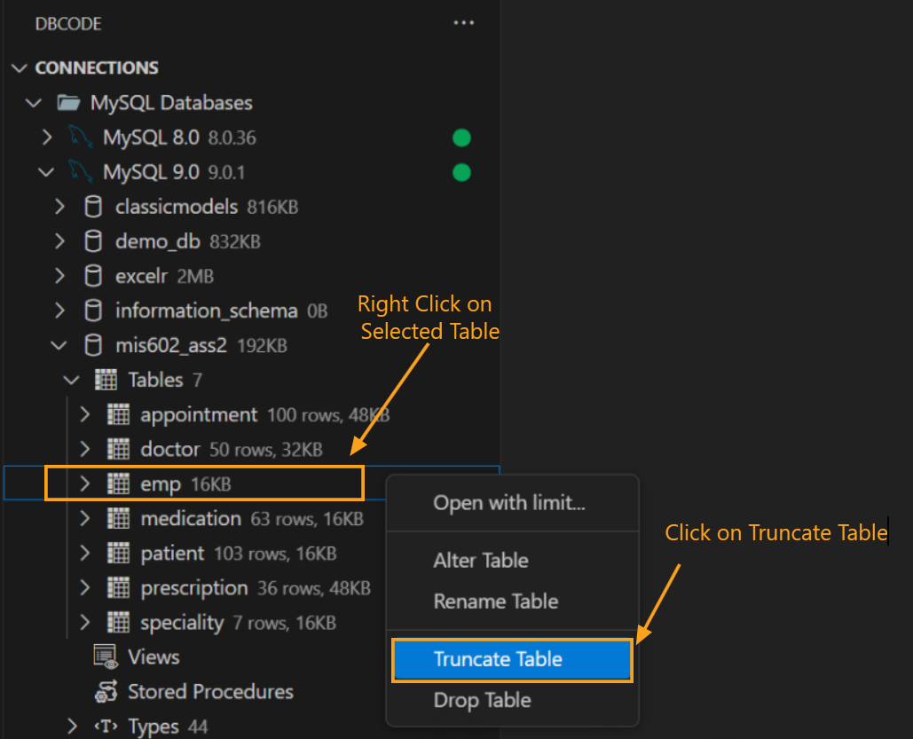
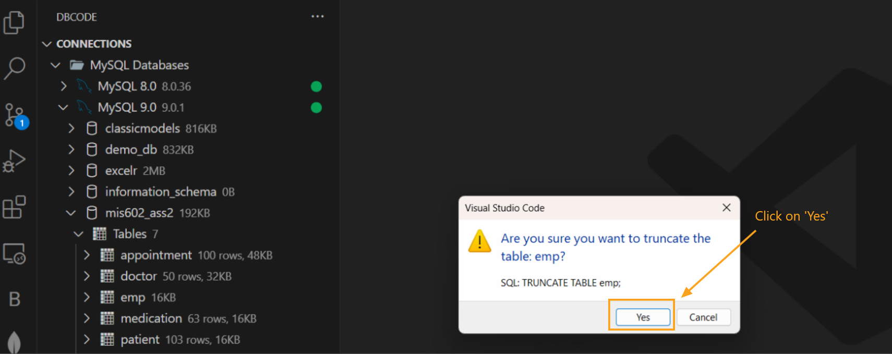
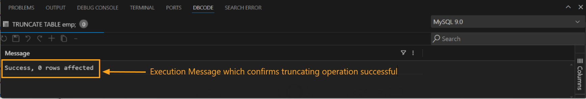

## Guide to Truncate a Table Without Using SQL Commands
Truncating a table removes all rows, freeing up storage while retaining the table structure and definitions. Unlike a delete operation, it is typically faster and cannot be rolled back in many databases.

### Select Database Connection
   - Open **Database Explorer** and choose the appropriate database connection.
   - From the list of available databases, select the one containing the table you wish to truncate.

### Locate and Select the Table
   - In the database tables list, find the table you need to truncate.
   - Right-click on the table name and choose **Truncate Table** from the context menu.

   

### Confirm Truncation
   - A confirmation dialog will appear, asking if you’re sure you want to proceed. Click **Yes** to confirm or **Cancel** to abort.

   

### Verify Success
   - After confirming, a success message will appear in the **DB Code Panel** at the bottom, indicating "Success, 0 rows affected," which confirms the table has been truncated.

    

This method allows you to quickly and safely truncate a table without manually entering SQL commands, reducing the chance of syntax errors.