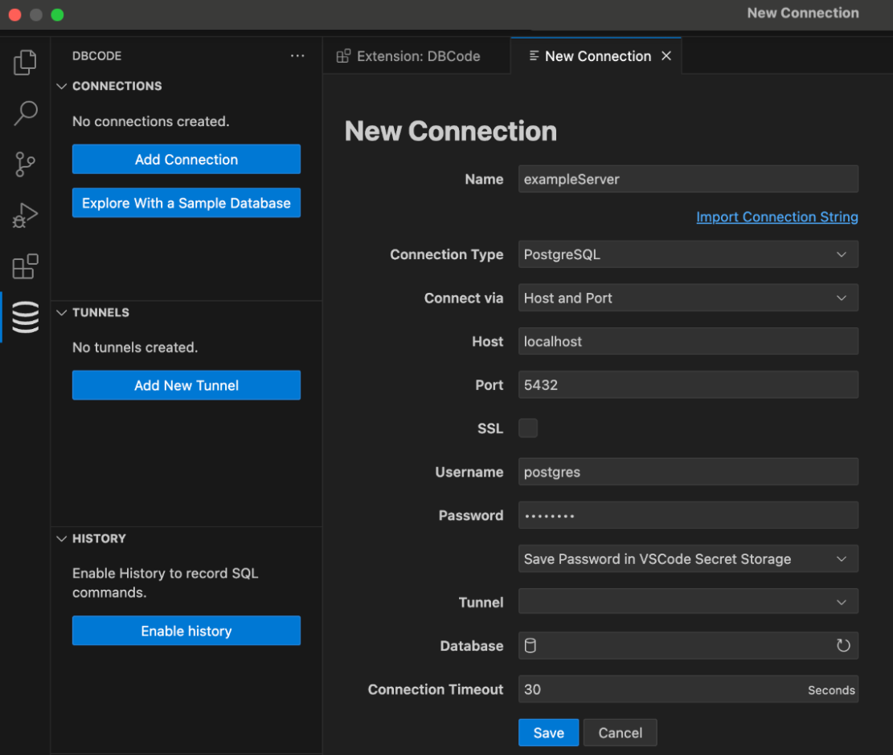
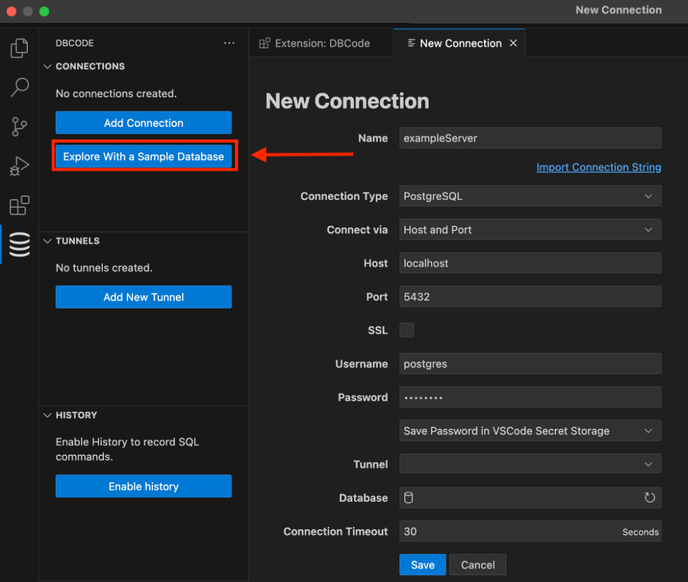

## Create a New Connection

1. Open Visual Studio Code and click on the DBCode icon in the activity bar (usually on the left-hand side).

2. Click the "Add Connection" Button, or the + icon in the explorer. Or open the command palette *Ctrl/Cmd+Shift+P* and select the "DBCode: Add Connection" option.

3. Enter Server Details:
     - Server Name: A name for the connection (e.g., My Database).
	 - Type: Select the database type (MySQL, PostgreSQL, SQL Server, etc).
     - Host: Enter the server's host address (e.g., localhost or the IP address of your server).
     - Port: Input the server's port number, usually 3306 for MySQL, 5432 for PostgreSQL, or 1433 for SQL Server.
	 - Username: The username for the database server.
	 - Password: The password for the database server.
	 - Database: The name of the database you want to connect to.

4. Save the Connection:
     - After entering all the required details, click the "Save" button to establish the connection.

5. The new connection will be saved, and you can start exploring the data and features of DBCode.

## Connect a Cloud Provider

Using a cloud provider grants access to all databases within that provider without needing to configure each one individually.

For more information, check out the [connect a cloud provider](/docs/cloud-providers) article.

## Use the Sample Database

To use the sample database included with the extension, follow these steps:

1. Open Visual Studio Code and click on the DBCode icon in the activity bar (usually on the left-hand side).

2. Click the "Explore With a Sample Database" button from the explorer. Or open the command palette *Ctrl/Cmd+Shift+P* and select the "DBCode: Explore With a Sample Database" option.

3. Select the “Sample Database” option.

4. The sample database will be loaded, and you can start exploring the data and features of DBCode.