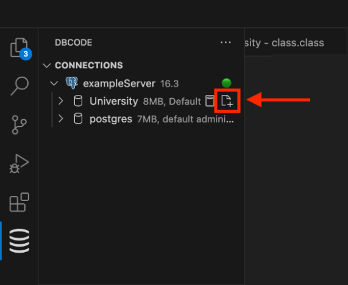
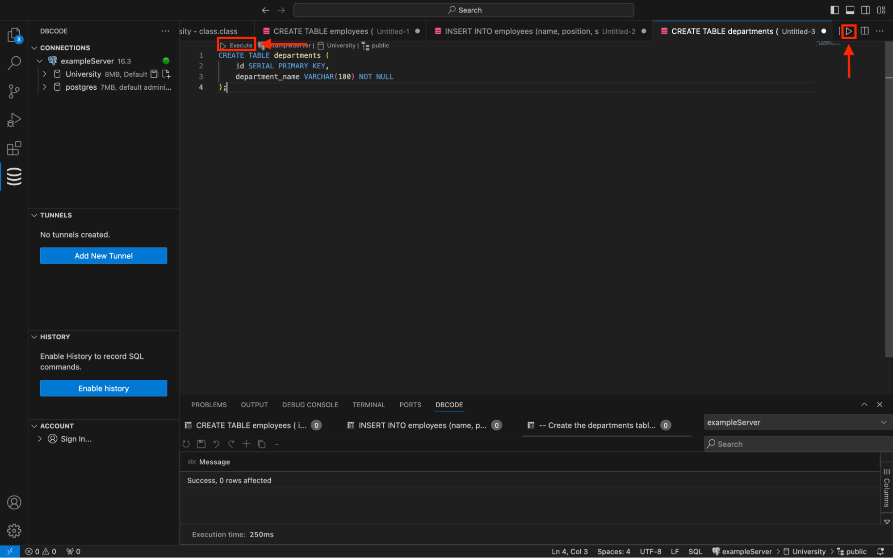
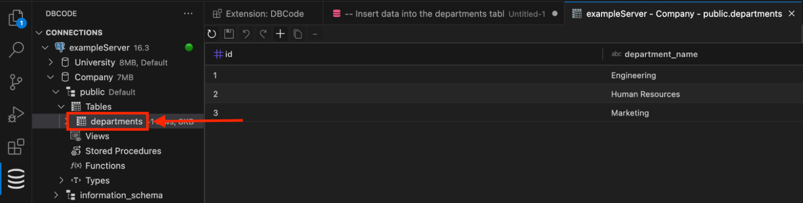
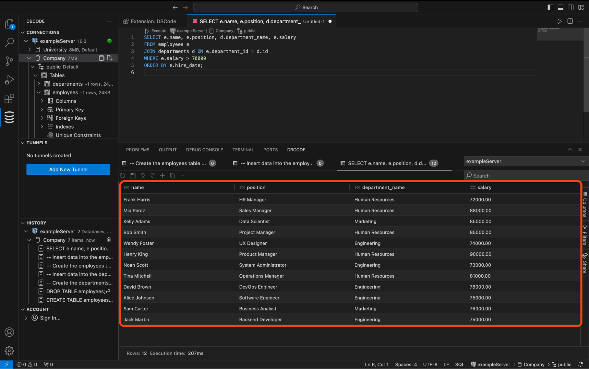

First, let's create our database table. 

## Open a New SQL File

To begin, open a new SQL file on the database by clicking the new file icon in the DBCode explorer.



## Execute a statement

To keep it simple, we will create a "departments" table first, as the "employee" table depends on it. Copy and paste the following code into the new SQL file:

```sql
-- Create the departments table

CREATE TABLE departments (
	id SERIAL PRIMARY KEY,
	department_name VARCHAR(100) NOT NULL
);
```

To run the SQL, you can execute via these options: 
 - Click the execute in the code lens at the top of the editor
 - Click the execute icon in the top right
 - Use the keyboard shortcut Ctrl/Cmd+D+E
 - Right-click and select the "Execute with DBCode" option



## Inserting Data

We will insert some sample data into the newly created table. Paste the following code into the SQL File, this time, select the code to execute only this code rather than the whole file. 

```sql
-- Insert data into the departments table 
INSERT INTO departments (department_name) VALUES 
    ('Engineering'), 
    ('Human Resources'), 
    ('Marketing');
```

Run the code using one of the above-mentioned execution methods.

## Viewing the Data

To verify that the data was inserted successfully, select the table from the DBCode explorer, which will open a new tab showing the records in the table.

Locate the table in the explorer and click on it to open.



## Executing Multiple Statements

Let's now execute multiple statements at once. These statements will create an "employees" table, insert some data, and perform a select query to join the employees to their departments.

Copy and paste the following code into a new SQL file, or replace the existing code in the current file:

```sql

-- Create the employees' table 

CREATE TABLE employees ( 
    Id SERIAL PRIMARY KEY,
    name VARCHAR(100) NOT NULL, 
    position VARCHAR(50) NOT NULL, 
    salary NUMERIC(10, 2) NOT NULL, 
    hire_date DATE NOT NULL, 
    department_id INT, 
    FOREIGN KEY (department_id) REFERENCES departments(id) 
); 

-- Insert data into the employees table 
INSERT INTO employees (name, position, salary, hire_date, department_id) VALUES
    ('Xander Hayes', 'Network Engineer', 78000.00, '2018-10-27', 1), 
    ('Yara Davis', 'Product Owner', 90000.00, '2019-01-07', 2), 
    ('Zoe Carter', 'Digital Marketer', 68000.00, '2020-05-09', 3), 
    ('Aaron Brooks', 'Software Architect', 95000.00, '2017-11-17', 1), 
    ('Bella Simmons', 'HR Assistant', 61000.00, '2018-03-01', 2), 
    ('Cody Fisher', 'Content Strategist', 64000.00, '2020-08-14', 3), 
    ('Diana Russell', 'Scrum Master', 85000.00, '2019-11-06', 2), 
    ('Ethan Coleman', 'Database Administrator', 82000.00, '2018-04-20', 1), 
    ('Fiona Miller', 'Marketing Coordinator', 67000.00, '2019-09-29', 3), 
    ('George Bailey', 'Technical Support Engineer', 62000.00, '2020-12-01', 1), 
    ('Hannah Reed', 'UI Designer', 73000.00, '2018-05-23', 3), 
    ('Ivan Kelly', 'Data Engineer', 87000.00, '2019-01-30', 1), 
    ('Julia Howard', 'Communications Specialist', 63000.00, '2020-10-16', 3), 
    ('Kevin Perez', 'Security Analyst', 79000.00, '2017-06-11', 1), 
    ('Laura Hughes', 'Recruiting Coordinator', 61000.00, '2019-05-24', 2), 
    ('Mike Patterson', 'Operations Analyst', 78000.00, '2018-08-20', 2), 
    ('Nina Rogers', 'Sales Associate', 66000.00, '2020-07-12', 3), 
    ('Oscar Turner', 'Financial Analyst', 81000.00, '2019-04-17', 2), 
    ('Penelope Foster', 'Public Relations Specialist', 69000.00, '2018-09-21', 3), 
    ('Quincy Morales', 'Web Developer', 72000.00, '2017-02-15', 1);

-- Select some data
SELECT e.name, e.position, e.salary, e.hire_date, d.department_name
FROM employees e
JOIN departments d ON e.department_id = d.id
WHERE e.salary > 70000
ORDER BY e.hire_date;

```

Now, execute the code. If you don't highlight any content first, you will be prompted to execute the whole document. Select "Yes."

The results should now be displayed in the DBCode panel at the bottom.



## Conclusion

Congratulations, you have successfully created tables, inserted data, and retrieved it.