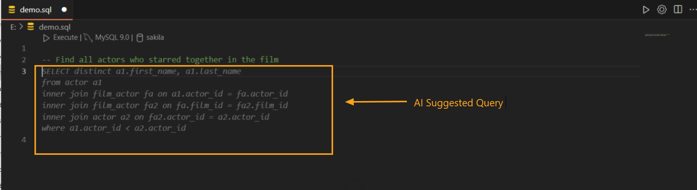
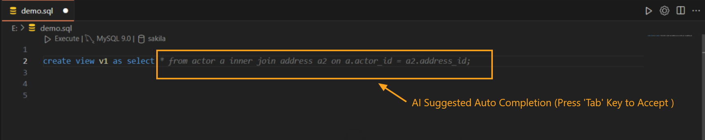

---

Title: Autocomplete

Description: The Autocomplete feature in DBCode uses AI to offer intelligent, context-aware suggestions as you type SQL commands. It provides quick access to table names, column names, and SQL keywords, making query creation faster and more efficient.

Order: 3

---

## AI-Powered Autocomplete Feature in DBCode

DBCode’s Autocomplete feature leverages AI to assist with SQL coding by providing real-time, context-aware suggestions. It intelligently recommends SQL commands, table names, columns, and functions as you type, and it can even convert natural language queries into SQL, making it easier to interact with your database.

### Key Features of AI-Powered Autocomplete

1. **Contextual Suggestions Powered by AI:**
   - Start typing a SQL command, and DBCode’s AI-powered Autocomplete will suggest contextually relevant options. The AI understands your query context, helping you complete complex SQL statements efficiently.

   

2. **Natural Language to SQL Conversion:**
   - Begin with `--` followed by a natural language question, and the AI will automatically generate the corresponding SQL query. For example, typing `-- find all actors who starred together in films` will prompt the AI to write the appropriate SQL code. This feature is available in both DBCode notebooks and SQL files, offering flexibility in usage.

   

3. **Schema-Aware Recommendations:**
   - DBCode provides the AI with access to your database schema, allowing it to offer suggestions based on the specific tables, columns, data types, and relationships in your database. This ensures more accurate and relevant recommendations while reducing the risk of syntax errors.

4. **Optional GitHub Copilot Integration:**
   - If GitHub Copilot is installed, DBCode integrates seamlessly with it for enhanced code-completion capabilities. If not, DBCode’s own AI model will power the Autocomplete, ensuring reliable support no matter your setup.

5. **Predictive Next-Line Suggestions:**
   - The AI predicts and completes your SQL queries, often suggesting logical next steps in your code. For instance, if you begin a `SELECT` statement, the AI may recommend possible joins or conditions based on your current query context and schema.

   

### Benefits of AI-Powered Autocomplete

- **Time-Saving:** Autocomplete reduces typing by predicting and generating parts of the query, helping you write SQL faster.

- **Improved Accuracy:** Schema awareness ensures accurate suggestions, minimizing the chance of syntax errors.

- **Natural Language Support:** Transforming natural language questions into SQL queries simplifies the query-building process, making it accessible to users with less SQL experience.

- **Smoother Workflow:** Intelligent suggestions make SQL coding more efficient, especially when working with complex queries that involve multiple tables and conditions.

---

DBCode’s AI-powered Autocomplete feature enhances SQL coding by combining schema-aware suggestions and natural language query generation. Whether you use GitHub Copilot or DBCode’s native AI, this feature improves productivity, reduces errors, and provides a seamless experience in both DBCode notebooks and SQL files.