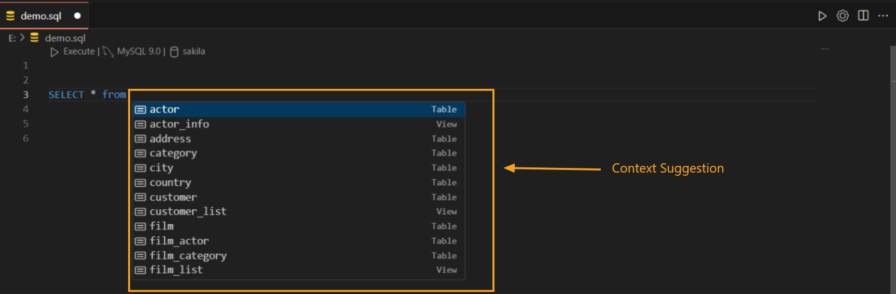

---

title: Autocomplete  
description: DBCode’s Autocomplete feature simplifies SQL query creation by offering a dropdown menu of intelligent, context-aware suggestions. These include table names, column names, and SQL keywords, helping you write queries faster and more accurately.  
order: 3  

---

## Autocomplete Feature in DBCode  

DBCode’s **Autocomplete** is designed to assist with SQL query creation by providing real-time, context-aware suggestions in a dropdown menu. This feature streamlines your workflow by reducing typing effort, improving accuracy, and enhancing productivity.  

### Key Features of Autocomplete  

1. **Context-Aware Dropdown Suggestions:**  
   - As you type, a dropdown menu appears with suggestions for table names, column names, SQL commands, and functions relevant to your query context.  

   - For example, typing `SELECT` brings up options like `*`, column names, or tables, while `WHERE` suggests relevant fields for filtering.  

     

2. **Schema-Aware Recommendations:**  
   - Autocomplete integrates with your database schema to suggest valid options based on the connected database.  

   - This ensures the suggestions include only accurate table names, column names, and data types, reducing the risk of errors.  

3. **SQL Syntax Highlighting and Validation:**  
   - Autocomplete supports SQL keywords and syntax, helping you construct valid queries and minimizing potential mistakes.  

4. **Keyboard Navigation:**  
   - Use the `Arrow Keys` to navigate the dropdown menu and press `Enter` or `Tab` to insert your selected option directly into your query.  

### Benefits of Autocomplete  

- **Speed:** Quickly locate and insert relevant fields, tables, or commands without needing to remember exact names or syntax.  

- **Accuracy:** Schema-awareness ensures that suggestions are valid and contextually appropriate.  

- **Ease of Use:** A dropdown menu simplifies navigation, making it easy for users of all experience levels to write SQL queries.  

- **Error Reduction:** Autocomplete minimizes typos and syntax errors, leading to more reliable query execution.  

---

DBCode’s Autocomplete feature is an essential tool for writing SQL efficiently and accurately. Whether you're exploring a database schema, constructing complex queries, or working on repetitive tasks, this feature provides a streamlined and intuitive experience.