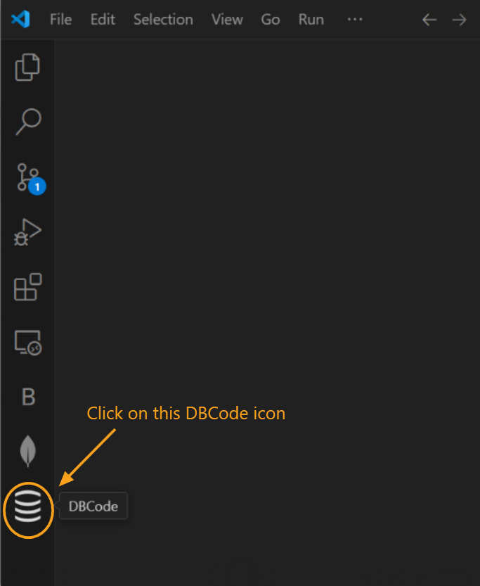
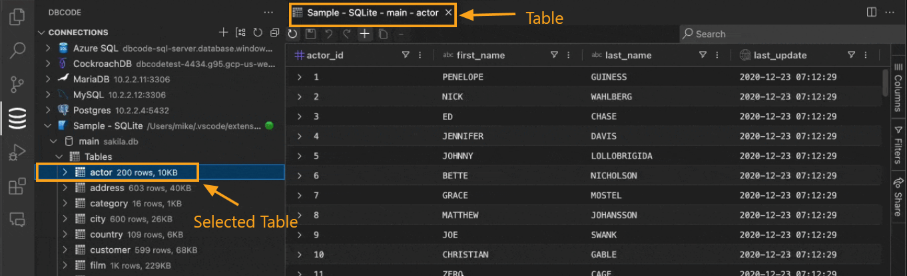
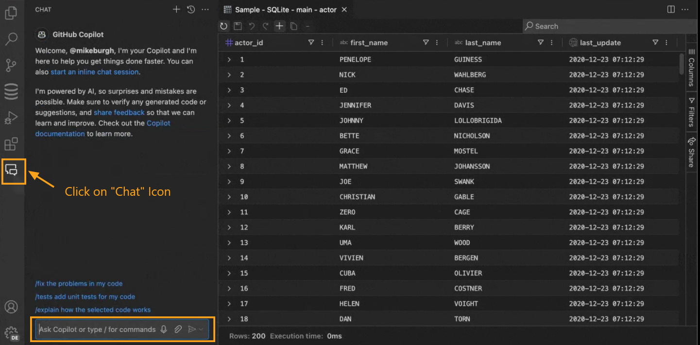
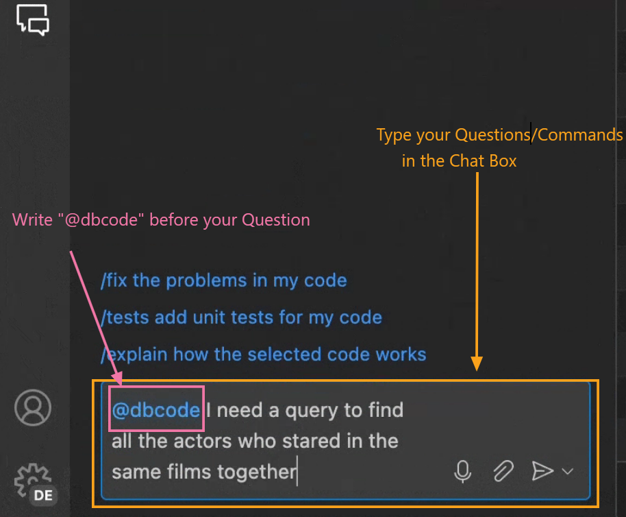
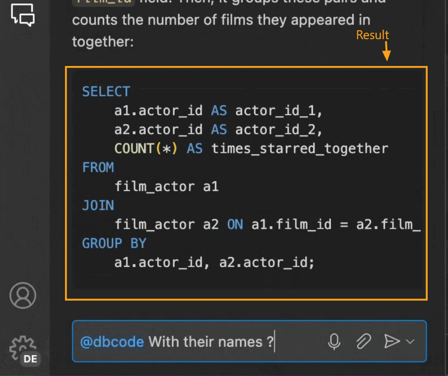
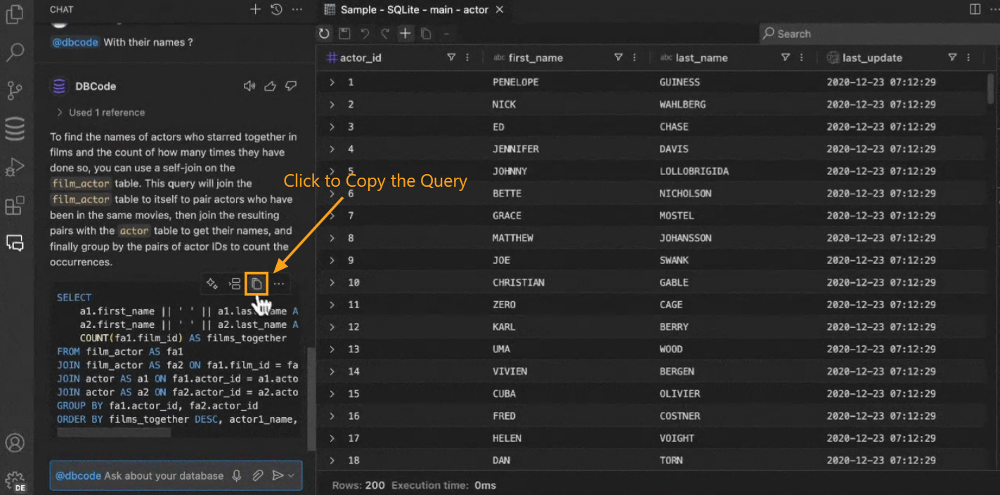

---

Title: Chat

Description: The Chat feature in DBCode enables seamless, interactive communication with your database directly in Visual Studio Code. Use SQL or natural language to query, retrieve, and edit data effortlessly, enhancing productivity and simplifying database management.

Order: 1

---

### Chat Feature in DBCode

The Chat feature in DBCode allows you to interact with your database by querying and modifying data directly within Visual Studio Code. Here’s how to make the most of it:

#### Accessing the Chat Feature

1. **Open DBCode in Visual Studio Code:**
   - Start Visual Studio Code and click on the DBCode icon in the Activity Bar on the left side.

   

2. **Select a Database Table:**
   - In the `Connections` pane, browse and select the database table you wish to work with. This action opens a view of the table’s data in the main editor window.

   

3. **Open the Chat Panel:**
   - Make sure you have the [GitHub Copilot extension](https://marketplace.visualstudio.com/items?itemName=GitHub.copilot) installed from the Visual Studio Code Marketplace, as it is required for the Chat feature to function.

   - Once installed, locate the **Chat** icon on the sidebar, typically shown as a text bubble icon on the right side of the table view. Click it to open the Chat panel.

   

#### Using the Chat Feature

1. **Submit Queries or Commands:**
   - Type your questions or commands, prefixed with `@dbcode`, directly into the chat box at the bottom of the Chat panel.

   - You can use natural language or SQL syntax to request data insights or modifications.

   

2. **View Query Results:**
   - After sending a question or command, the Chat panel will display the results within the same window, allowing you to review responses without switching contexts.

   

3. **Copy SQL Query from Chat:**
   - Once you receive a response in the chat, you can copy the generated SQL query by clicking on the `Copy` icon at the top of each SQL query in the response.

   

4. **Use the Copied Query in the SQL Editor/DBCode Notebook:**
   - After copying the SQL query, you can paste it into an SQL file or DBCode notebook with the same connection and database to execute the query and view the output.

   - When finished, you can close the Chat panel to return to the database view or keep it open for ongoing interactions.

---

The Chat feature in DBCode offers a user-friendly way to query and interact with your data, making database management more accessible within Visual Studio Code. This functionality provides quick insights, enables easy data modifications, and supports efficient, streamlined workflows.