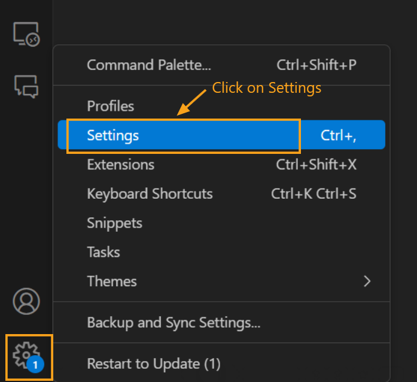
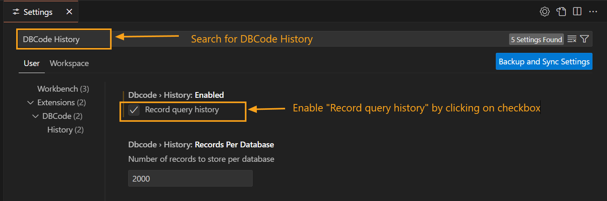
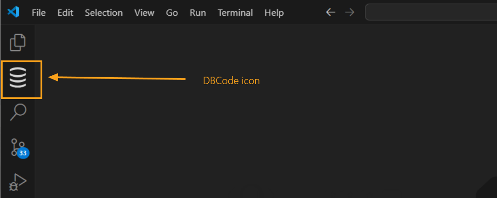
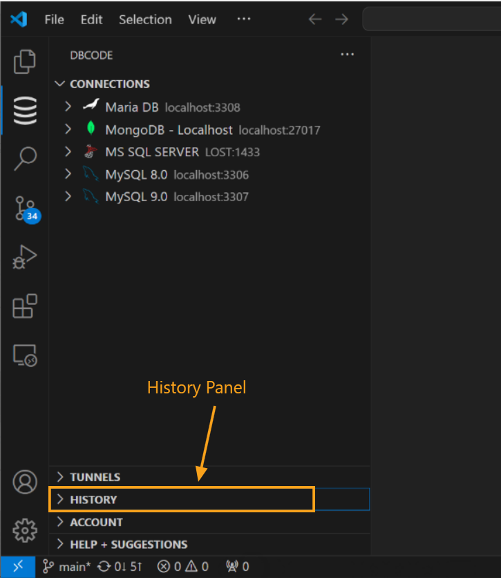
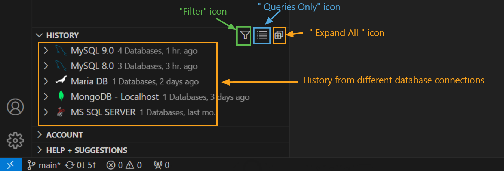
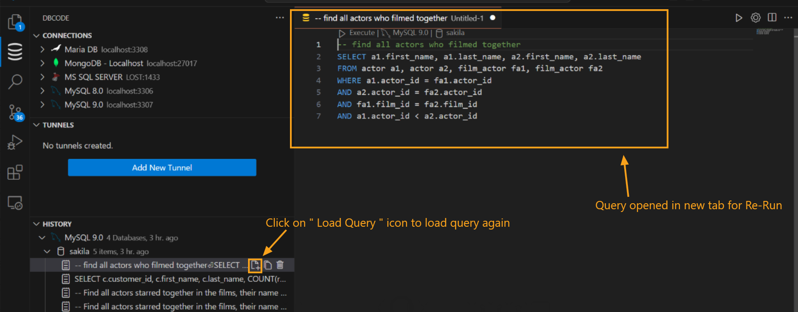
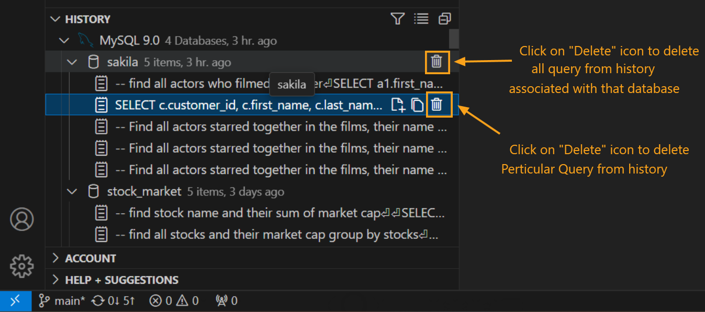

---

title: History  
description: The History feature in DBCode automatically logs executed SQL queries, allowing you to review, reuse, and manage past queries with ease.  
order: 4  

---  

## Query History in DBCode  

The History feature in DBCode keeps a log of all executed SQL queries, enabling you to revisit, reuse, and manage past commands efficiently. It’s a valuable tool for tracking query development, maintaining frequently used queries, and troubleshooting.  

### Enabling Query History  

By default, the History feature is **disabled**. To enable it:  

1. **Open DBCode Settings:**  
   - In Visual Studio Code, click on the gear icon in the lower-left corner and select **Settings**.  

    

2. **Search for DBCode Settings:**  
   - In the settings search bar, type `DBCode History`.  

3. **Enable Query History:**  
   - Locate the option to enable query history and toggle it on. Once activated, DBCode will start recording all executed SQL queries.  

     

---

### Accessing Query History  

1. **Open DBCode in Visual Studio Code:**  
   - Launch Visual Studio Code and click the DBCode icon in the Activity Bar on the left.  

     

2. **Open the History Panel:**  
   - In the DBCode sidebar, click the **History** tab to access the list of previously executed queries.  

     

---

### Using the History Panel  

1. **View Past Queries:**  
   - The History panel shows a chronological list of queries from various database connections.  
   - Use the `Expand All` icon to see all details or the `Queries Only` icon to focus solely on queries.  
   - Apply filters using the `Filter` icon to narrow your view based on specific criteria.  

     

2. **Re-Run a Query:**  
   - Click the **Load Query** icon next to any query to reload it into a new editor tab for the selected database connection.  

     

3. **Edit and Copy Queries:**  
   - Use the **Copy SQL** icon to duplicate a query. Paste it into the editor to modify or use as a new template.  

     

4. **Clear History:**  
   - To delete a query, click the **Delete** icon next to it. Confirm the action by selecting "Yes" in the prompt.  

     

---

### Benefits of Using Query History  

- **Time-Saving:** Quickly re-run frequently used queries without retyping.  
- **Efficient Troubleshooting:** Easily review past queries to identify and resolve issues.  
- **Organized Workflow:** Maintain a comprehensive log of query development for easy reference.  

---

By enabling and using the History feature in DBCode, you can streamline your workflow and make database interactions in Visual Studio Code more efficient and organized.