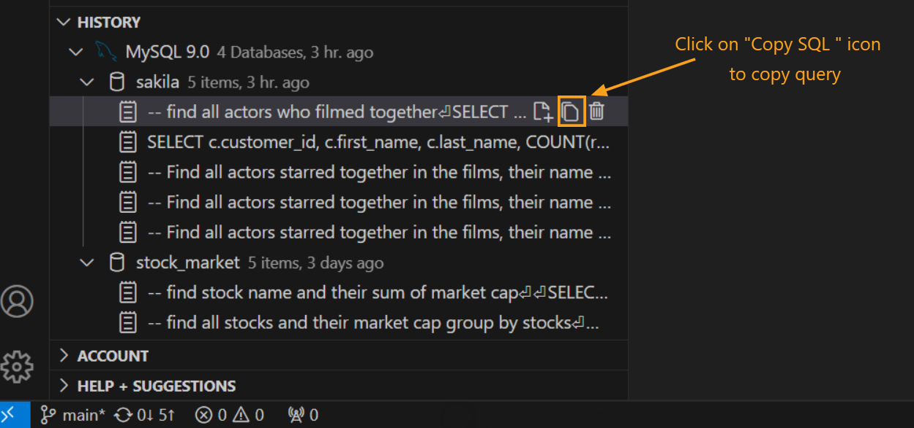

---

Title: History

Description: The History feature in DBCode automatically logs executed SQL queries, allowing you to review, reuse, and manage past queries with ease.

Order: 4

---

## Query History in DBCode

The History feature in DBCode provides a convenient log of all executed SQL queries, making it easy to revisit and reuse commands. This feature is valuable for tracking query development, maintaining frequently used queries, and troubleshooting by reviewing past commands.

### Accessing Query History

1. **Open DBCode in Visual Studio Code:**
   - Launch Visual Studio Code and click on the DBCode icon in the Activity Bar on the left.

   

2. **Open the History Panel:**
   - In the DBCode sidebar, locate and click the **History** tab to access a list of previously executed queries.

   

### Using the History Panel

1. **View Past Queries:**
   - The History panel displays a chronological list of queries from different database connections.
   - Use the `Expand All` icon to view all queries, and the `Queries Only` icon to display queries without other details.
   - Filter queries with the `Filter` icon in the panel header to refine your view.

   

2. **Re-Run a Query:**
   - To re-execute a previous query, click the **Load Query** icon next to the query. This loads the query into a new editor tab for the selected database connection.

   

3. **Edit and Copy Queries:**
   - To copy a query, click the **Copy SQL** icon next to it in the History panel. Paste the copied query into an editor to modify or use it as a new template.

   

4. **Clear History:**
   - To delete specific entries, click the **Delete** icon next to each query. Confirm the action in the prompt by selecting "Yes" to permanently remove it.

   

### Benefits of Using Query History

- **Time-Saving:** Quickly rerun frequently used queries without retyping.
- **Efficient Troubleshooting:** Review and troubleshoot past queries with ease.
- **Organized Workflow:** Keep a comprehensive log of query development, making it easy to reference past work.

---

The History feature in DBCode streamlines SQL management by keeping a detailed log of past queries, making database interaction in Visual Studio Code more efficient and organized.