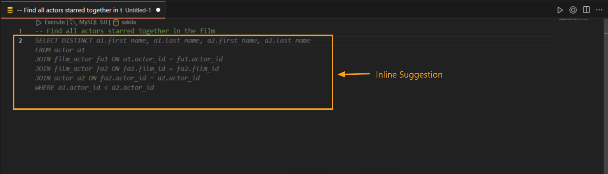
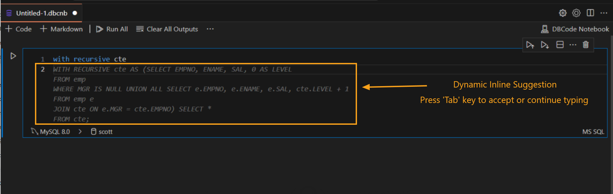

---

title: Inline Completion  
description: DBCode’s Inline Completion enhances SQL coding productivity by offering real-time, context-aware suggestions directly within your editor. This feature helps you write SQL queries faster and with fewer errors.  
order: 2  

---

## Inline Completion in DBCode  

DBCode’s **Inline Completion** feature provides intelligent, real-time suggestions directly within your code editor as you type SQL queries. This tool predicts and suggests the next part of your query, enabling a smoother and faster coding experience by reducing manual effort and potential errors.  

### How to Use Inline Completion  

1. **Start Typing a SQL Query:**  
   - Begin writing your SQL query or command in a DBCode-supported environment, such as a `.sql` file or a DBCode Notebook.  

   - As you type, Inline Completion displays light grey text suggesting how to complete your query based on the context.  

     

2. **Accept Suggestions:**  
   - Press `Tab` or `Enter` to insert the suggested code snippet into your query.  

   - Suggestions can include table names, column names, SQL keywords, or functions, saving you from typing them manually.  

3. **Dismiss Suggestions:**  
   - To ignore a suggestion, simply keep typing, and the prediction will adjust dynamically to the new input.

   - Alternatively, press `Esc` to dismiss the current suggestion entirely.  

4. **Dynamic Updates:**  
   - Inline Completion updates its predictions in real-time as you continue typing, refining suggestions to align with the evolving context of your query.  

     

### Benefits of Inline Completion  

- **Speed:** Write queries faster by leveraging intelligent predictions that eliminate unnecessary typing.  

- **Accuracy:** Reduce syntax errors with context-aware, compliant suggestions tailored to your database schema.  

- **Convenience:** Avoid interruptions by getting in-line predictions directly in the editor, without needing external references or dropdowns.  

- **Focus:** Concentrate on query logic while the tool assists with syntax and structure.  

---  

DBCode’s Inline Completion is a powerful feature for SQL developers, streamlining query creation by predicting and suggesting contextually appropriate completions. Whether you’re a beginner or a seasoned professional, this tool enhances productivity and coding efficiency in Visual Studio Code.