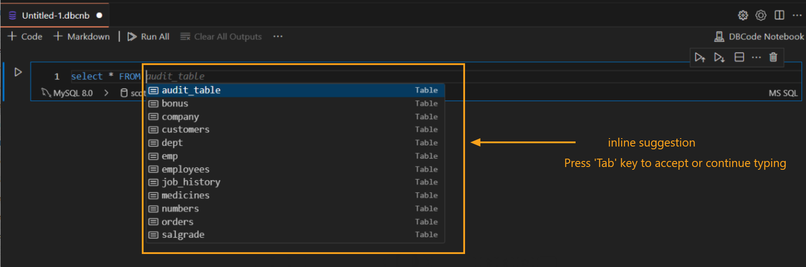

---

Title: Inline Completion

Description: The Inline Completion feature in DBCode enhances productivity by offering real-time code suggestions as you type, helping you write SQL queries and commands faster and with fewer errors.

Order: 2

---

### Inline Completion in DBCode

The Inline Completion feature in DBCode provides real-time suggestions while you write SQL queries and other commands within Visual Studio Code. This feature uses intelligent code prediction to help you complete commands accurately and quickly.

#### How to Use Inline Completion

1. **Start Typing a SQL Query:**
   - Begin writing your SQL query or command in the editor (Sql File or DBCode Notebook) where you want to interact with your database.

   - As you type, DBCode will automatically suggest relevant code completions based on the context of what you’re typing.

   

2. **Accept a Suggested Completion:**
   - To accept a suggested completion, press the `Tab` or `Enter` key. This will insert the suggested code snippet directly into your editor.

   - You can use this feature to complete table names, column names, SQL keywords, and functions without needing to type them in full.

3. **Dismiss a Suggested Completion:**
   - If the suggested completion is not what you want, you can simply continue typing, and the suggestion will update based on the new context.
   
   - Alternatively, you can press `Esc` to dismiss the current suggestion.

4. **Modify Suggestions as You Type:**
   - The inline completion feature dynamically adjusts its suggestions as you continue typing, so you can get more precise completions as your query takes shape.

   

#### Benefits of Using Inline Completion

- **Faster Query Writing:** Inline Completion speeds up query writing by predicting the most likely commands or names based on what you've typed, reducing the need for manual entry.
  
- **Reduced Syntax Errors:** By providing syntax-compliant suggestions, this feature helps minimize errors, especially for complex queries or long table/column names.

- **Improved Focus:** Inline Completion allows you to focus on the logic of your query without needing to look up or remember exact names and syntax.

---

The Inline Completion feature in DBCode is an invaluable tool for users who want to write SQL queries more efficiently. By offering context-aware suggestions, it helps reduce errors, speeds up query development, and streamlines the coding experience in Visual Studio Code.