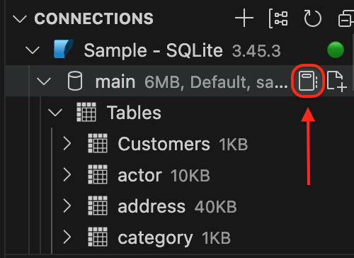
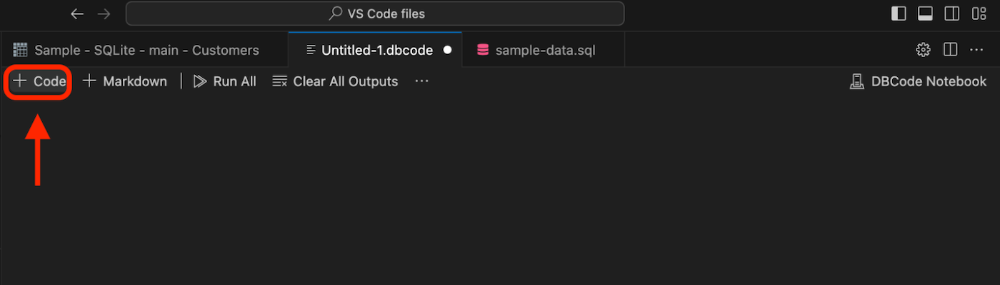
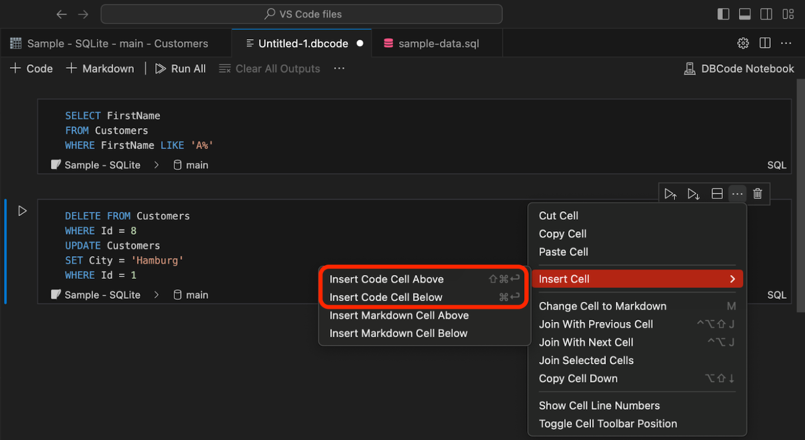
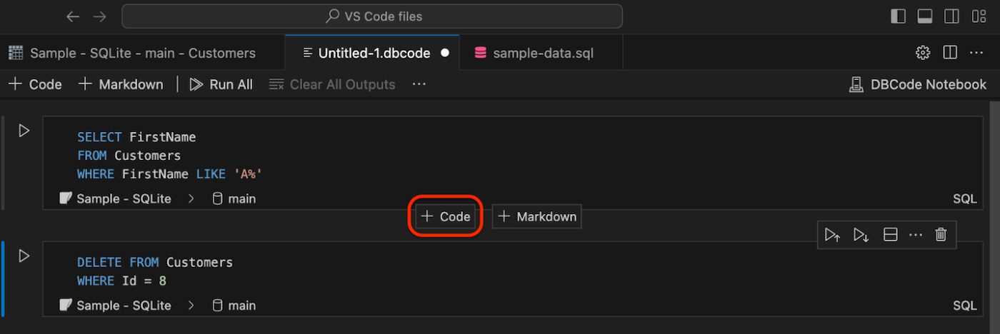
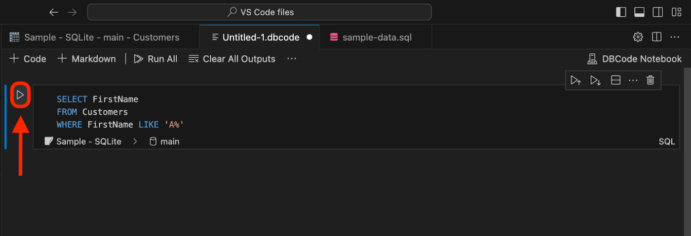
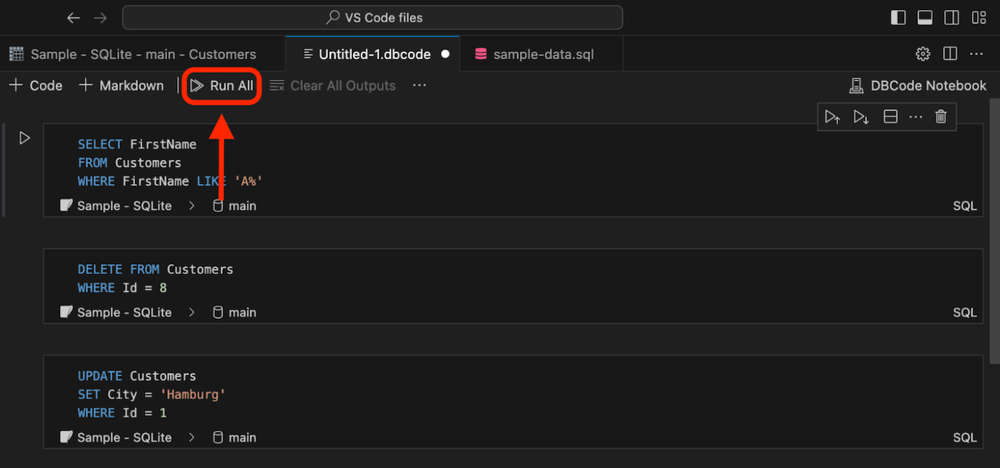
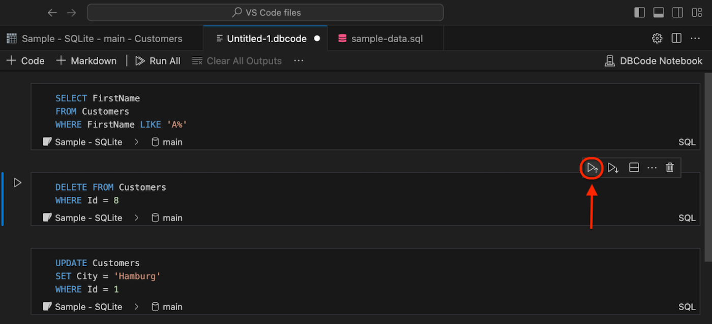
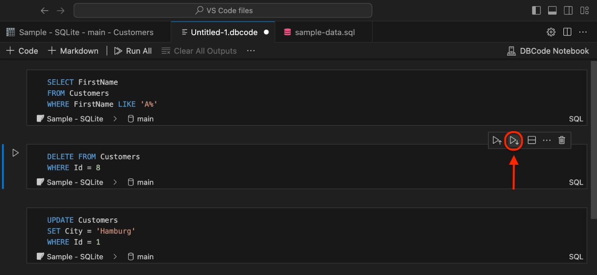
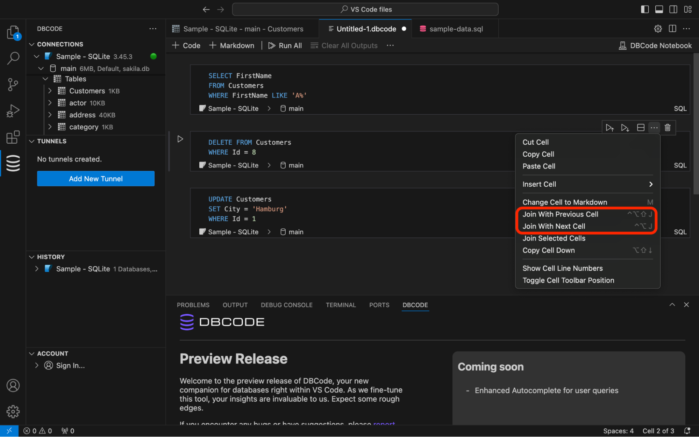

## Opening a new Notebook 

To open a new notebook click the  "Create a new DBCode Notebook" icon that appears in the DBCode Explorer, when you hover over a database.

## Adding a Cell

To add a cell, click the "Add code cell" button at the top.

You can also add a cell from the "More Actions..." button in the cell toolbar.

Additionally, you can hover with your mouse at the top or bottom of a cell and choose whether to insert a cell above or below.

## Execute a Query

To execute a specific cell, click the "Execute cell" button to the left of the code cell you wish to run.

If you have more than one code cell and would like to execute them all, click the "Run All" button at the top.

To execute the cells above the current one, click the "Execute Above Cells" button in the cell toolbar.

To execute the selected cell and all cells below it, click the "Execute Cell and Below" button in the cell toolbar.

## Joining cells

If you would like to join a cell with the cell above or below it, find these options by clicking the "More Actions..." button in the cell toolbar. This helps in organizing and managing your code more efficiently.

### Joining with Previous Cell
This combines the current cell with the one above.

### Joining with Next Cell
This combines the current cell with the one below.

