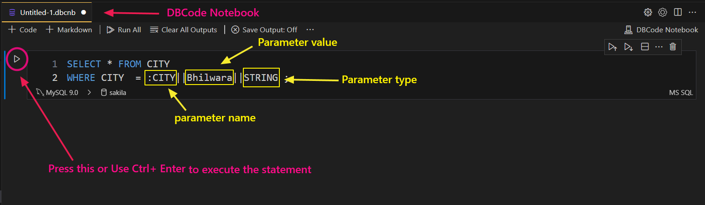
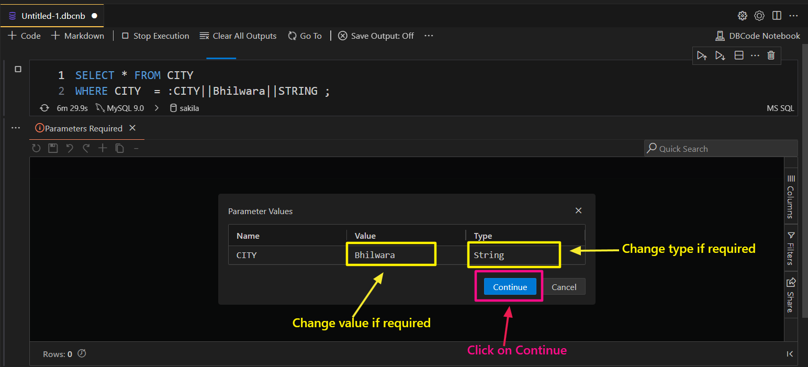
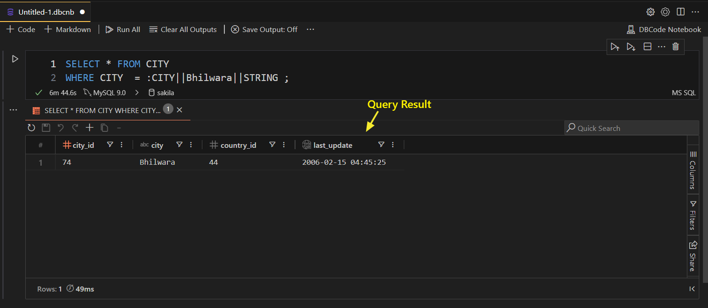

## Query Parameters in DBCode  

DBCode supports flexible query parameter formats to help you write dynamic and secure queries. Query parameters can seamlessly share data between DBCode notebook cells, enabling more interactive and efficient workflows. This guide explains the supported parameter formats, their optional components, and best practices for effective usage.  

---

### Supported Query Parameter Formats  

DBCode allows you to define query parameters in four distinct formats:  

1. **&name||value||type**  
2. **$name||value||type**  
3. **:name||value||type**  
4. **%name||value||type**  

---

### Optional Components of Query Parameters 

Each format supports the following optional components:  

- **value:** The value assigned to the parameter.  
- **type:** Specifies the data type for the parameter value. Supported types are:  
  - **string:** Escapes the value as a text string.  
  - **number:** Treats the value as a numeric type.  
  - **date:** Handles date formats appropriately.  
  - **identifier:** Indicates that the parameter is not escaped.  

> **Note:** If no type is supplied, DBCode will attempt to infer the type automatically.

---

### Handling Spaces in Parameter Names or Values

If your parameter name or value contains spaces, you can enclose it in curly braces `{}` or parentheses `()` to avoid syntax errors.  

**Example:**  
```sql
SELECT * FROM orders WHERE customer_name = {&customer name||John Doe||string}
```
---

### Steps to Use Query Parameters in DBCode

**1. Open DBCode Query Editor**
- Launch DBCode within Visual Studio Code and create or open a `SQL editor` or `DBcode notebook`.

**2. Write a Query with Parameters**
- Use one of the supported parameter formats in your SQL query.  
- Then execute the query by using `Ctrl+Enter` or by clinking on **Play** button



**3. Provide Values and Type for Missing Parameters**
- If any parameter value is not provided directly in the query, DBCode will prompt you to input the required values and type of the parameter.
- Then click on  `Continue` button to execute the parameterised query.



**4. Review Query Results**
- DBCode will execute the query with the provided parameter values and display the result.


---

### Seamless Sharing Between Notebook Cells

- Query parameters can share data across notebook cells. When you define a parameter in one cell, it can be referenced in subsequent cells.

- DBCode will catch previously defined parameter values when you execute the cell, and a prompt will appear in the result panel, asking if you want to continue using the same value or modify it. If no changes are made, click on Continue to proceed.
---

### Saving Parameter Values (Optional)

- If the Save Output feature is turned ON, DBCode saves the parameter values within the notebook, ensuring that they persist across sessions.
---

### Examples of Query Parameter Usage

1. **Using the '&' Format:**  
```sql
SELECT * FROM users WHERE username = &user||admin||string
```

2. **Using the '$' Format:**  
```sql
SELECT * FROM transactions WHERE amount = $amount||100||number
```

3. **Using the ':' Format:**  
```sql
SELECT * FROM events WHERE event_date = :event_date||2024-12-25||date
```

4. **Using the '%' Format:**  
```sql
SELECT * FROM products WHERE category = %category||Electronics||identifier
```
---

### Tips for Best Practices

- **Always Specify Types:** Whenever possible, define the parameter type to ensure correct query execution.  
- **Escape Special Characters:** Use curly braces `{}` or parentheses `()` when names or values contain spaces.  
- **Avoid Unescaped Identifiers:** Use the `identifier` type cautiously to prevent security vulnerabilities like SQL injection.  
- **Consistency:** Stick to a single query parameter format for better readability and maintenance.  