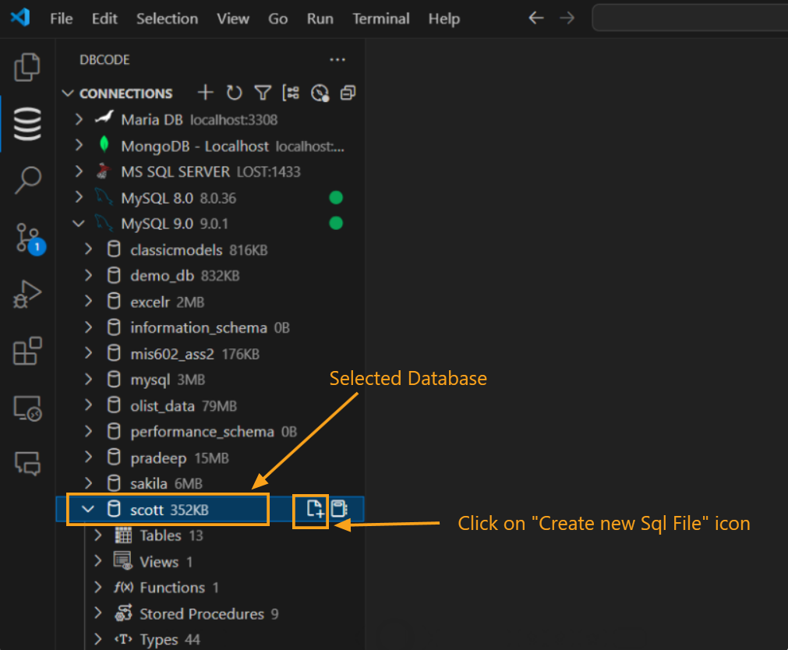
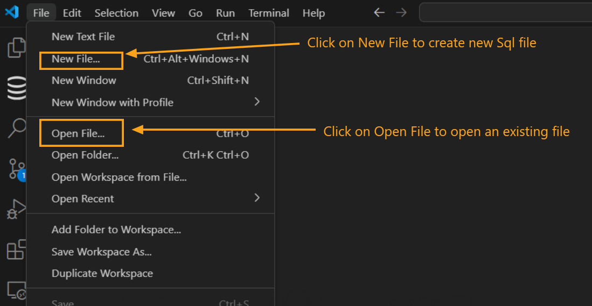
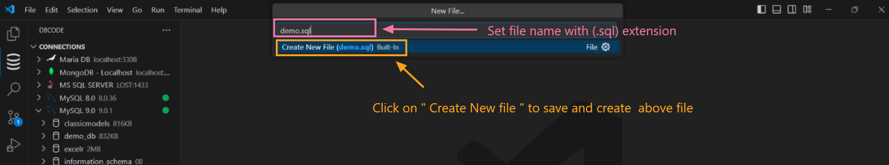
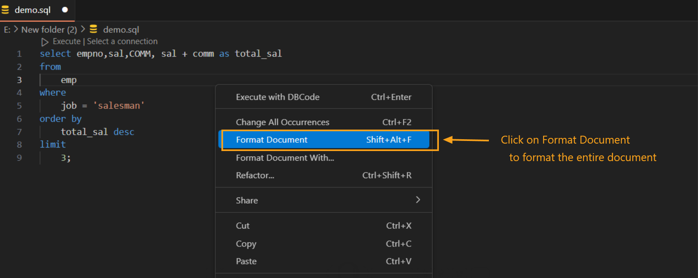
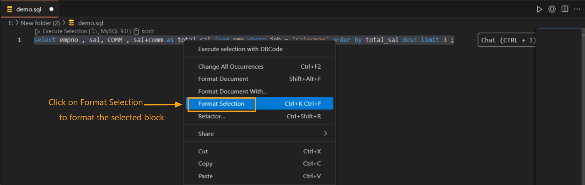
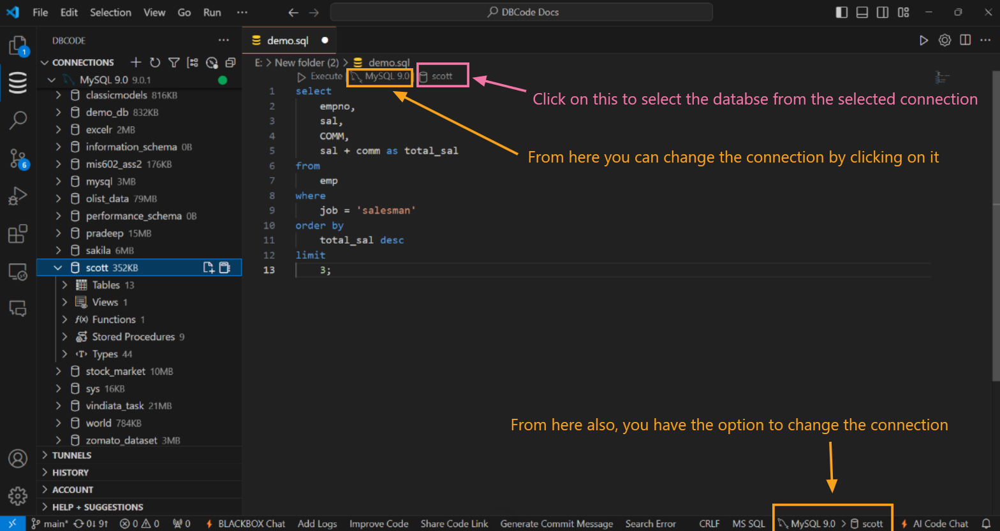
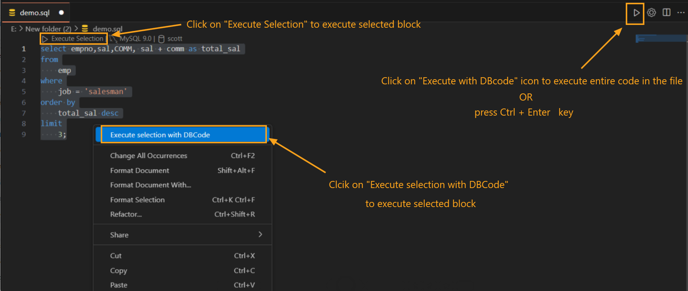
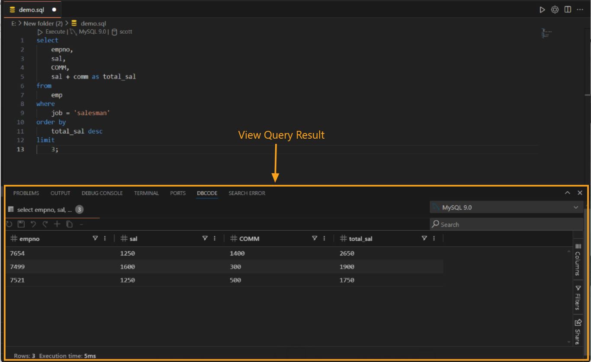
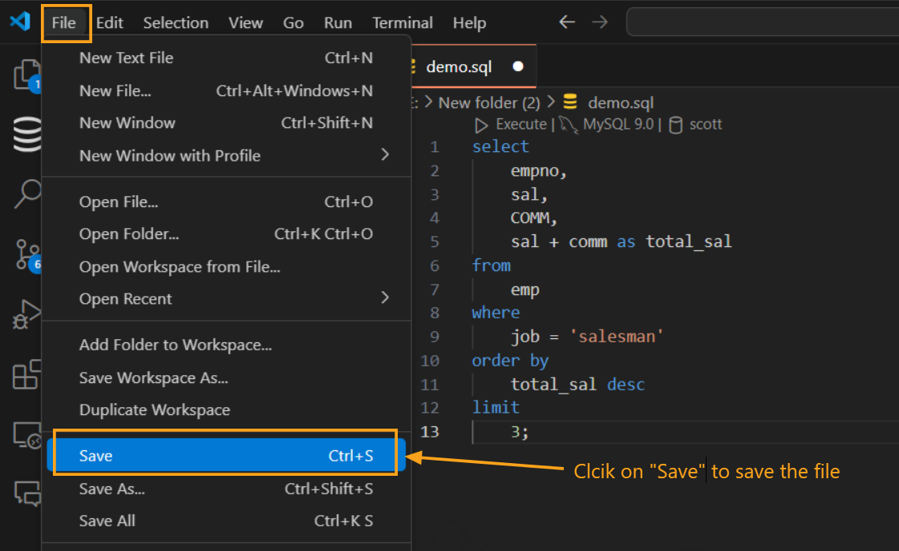

---

title: SQL Editor  
description: The SQL Editor in DBCode enables you to create, execute, and manage SQL queries within `.sql` files in Visual Studio Code, featuring syntax highlighting, code formatting, intelligent autocomplete, and seamless connection switching.  
order: 5  

---

## SQL Editor in DBCode (.sql File)  

The SQL Editor in DBCode provides a powerful environment for working with `.sql` files, making it easy to write, execute, and manage SQL queries. It offers intelligent features like syntax highlighting, code formatting, autocomplete, and the ability to quickly switch database connections, ensuring a seamless and efficient workflow.

---

### Using the SQL Editor  

#### 1. **Create or Open a `.sql` File**  
- **From the Connections Panel:**  
  Open the `Connections` pane in DBCode, select your desired database connection, and click the **Create New SQL File** icon next to the database.  

    

- **From the File Menu:**  
  Alternatively, click on the **File** menu in Visual Studio Code, select **New File**.

    

  Then set the file name and save it with a `.sql` extension, and start working.  

    

#### 2. **Write SQL Code**  
- Begin typing SQL commands to take advantage of syntax highlighting, autocomplete, and error detection.  

- Use features like **[Autocomplete](/docs/query/autocomplete)** and **[Inline Completion](/docs/query/inline-completion)** for enhanced coding assistance.  

#### 3. **Format Code**  
- **Format Entire Document:**  
  Right-click anywhere in the file and choose **Format Document**, or use the shortcut **Alt+Shift+F**.  

    

- **Format Selected Code:**  
  Highlight a code block, right-click, and select **Format Selection**, or use **Ctrl+K Ctrl+F** (Windows/Linux) or **Cmd+K Cmd+F** (macOS).  

  

#### 4. **Switch Database Connections**  
- Use the dropdown in the code lens at the top of the editor or the status bar to change the active database connection.  

- Easily switch between databases without closing or reopening the file.  

    

#### 5. **Execute Queries and View Results**  
- **Run Selected Queries:**  
  Highlight a query and click **Execute Selection** from the toolbar or right-click and select **Execute Selection with DBCode**.  

- **Run All Queries:**  
  Click the **Execute Query** icon at the top-right corner or press **Ctrl+Enter** to run all queries in the file.  

    

- **View Results:**  
  Query results are displayed in the DBCode Results Panel at the bottom of the editor.  

    

#### 6. **Save and Reuse Queries**  
- Save your `.sql` file with comments and code for future use by going to **File > Save** in the menu bar.  

    

---

### Benefits of the SQL Editor  

- **Flexible Connection Switching:** Effortlessly toggle between database connections within a single file.  

- **Enhanced Efficiency:** Advanced features like autocomplete, syntax highlighting, and formatting speed up the query-writing process.  

- **Integrated Workflow:** Easily manage and view results within the same editor, ensuring a smooth SQL development experience.  

---

DBCode’s SQL Editor brings an intuitive and feature-rich experience to managing `.sql` files in Visual Studio Code, empowering users to write and execute SQL commands efficiently while maintaining organized workflows.