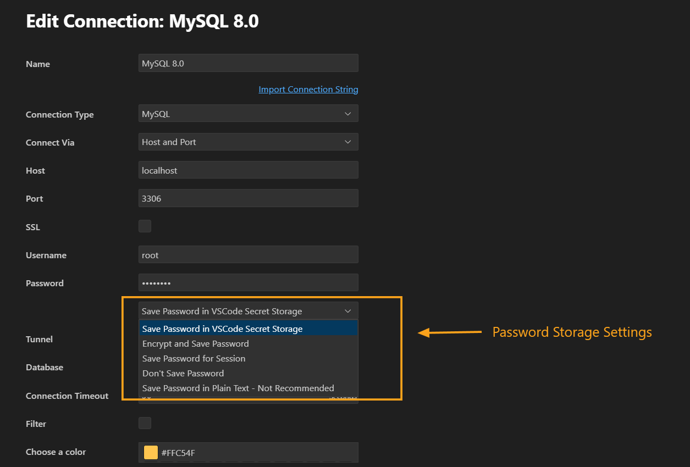
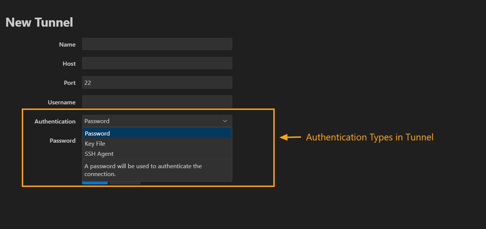

---

title: Password Storage in DBCode  
description: Learn how DBCode securely manages password storage for tunnels and connections, ensuring confidentiality and integrity in your database workflows.  
order: 1

---

## **Overview of Password Storage**

DBCode provides multiple password storage options to suit diverse security and usability needs. From session-only storage to encrypted synchronization, these options ensure flexibility without compromising security.  

---

## **Password Storage Options**

When configuring a tunnel or database connection in DBCode, you can choose from the following options:

   

### **1. Don't Save Password**  
- **Behavior:**  
  The password is not saved and must be entered manually each time you connect.  

- **Use Case:**  
  Ideal for environments where security policies mandate avoiding any form of password storage.  

---

### **2. Save Password for Session**  
- **Behavior:**  
  The password is stored temporarily in memory and remains valid only for the current DBCode session. Upon restarting DBCode, the password must be re-entered.  

- **Use Case:**  
  Best for temporary connections or when persistent storage is unnecessary.  

---

### **3. Save Password in Plain Text (Not Recommended)**  
- **Behavior:**  
  The password is stored in plain text within the DBCode settings file. If VSCode settings sync is enabled, this file, including the password, could be synced across devices.  

- **Recommendation:**  
  Avoid using this option due to security risks.  

- **Alternative:**  
  Opt for **Encrypt and Save Password** for a secure yet synchronized solution.  

---

### **4. Encrypt and Save Password**  
- **Behavior:**  
  The password is encrypted with a user-provided encryption string and saved in the settings file. The encrypted password can be synced securely across devices.  

- **How It Works:**  
  - You’ll be prompted to set an encryption string during setup.  
  - The password is encrypted using the string before storage.  

- **Use Case:**  
  Recommended for users who need to sync settings while ensuring password security.  

---

### **5. Save Password in VSCode Secret Storage (Default)**  
- **Behavior:**  
  The password is stored securely using VSCode’s built-in secret storage, which varies by platform:  
  - **Windows:** Stored in Windows Credential Manager.  
  - **macOS:** Stored in Keychain.  
  - **Linux:** Stored in GNOME Keyring or KDE Wallet.  

- **Advantages:**  
  - Passwords are not included in settings files, ensuring they are not synced with other connection details.  
  - This is the **default and most secure option** for local password storage.  

- **Use Case:**  
  Ideal for users who prioritize local security over portability.  

---

## **Password Storage for Tunnels**

DBCode supports tunneling protocols like SSH for secure connections. Password storage for tunnels follows the same options as database connections. 

For more detailed information on tunnels , refer to [SSH Tunnels](/docs/connections/ssh-tunnels)

### **Key Features for Tunnel Security**  

   

1. **Password-Based Authentication**  
   - Use a password to authenticate the tunnel connection.  

2. **SSH Agent Authentication**  
   - Authenticate using an SSH agent, which securely stores your private keys in memory.    

3. **Key File Authentication**  
   - Use an SSH key file to authenticate without requiring a password.

---

## **Best Practices for Password Security**

1. **Avoid Plain Text Storage:**  
   Never store passwords in plain text unless absolutely necessary. Use encryption to mitigate risks.  

2. **Use Strong Passwords:**  
   Ensure passwords are complex and unique to each connection.  

3. **Leverage SSH Keys:**  
   Replace password-based tunnel authentication with public/private key authentication.  

4. **Regularly Audit Credentials:**  
   Periodically review saved passwords and remove unused connections.  

5. **Default to Secret Storage:**  
   Always use VSCode secret storage when syncing is unnecessary.  

---

## **Summary**

DBCode’s password storage options are designed to provide flexibility while maintaining the highest security standards. The default **Save Password in VSCode Secret Storage** is the most secure option for local storage. For users requiring synchronization, **Encrypt and Save Password** ensures safe and portable credential management.  

By following the outlined best practices, you can maintain a secure and efficient workflow while protecting sensitive credentials.  
