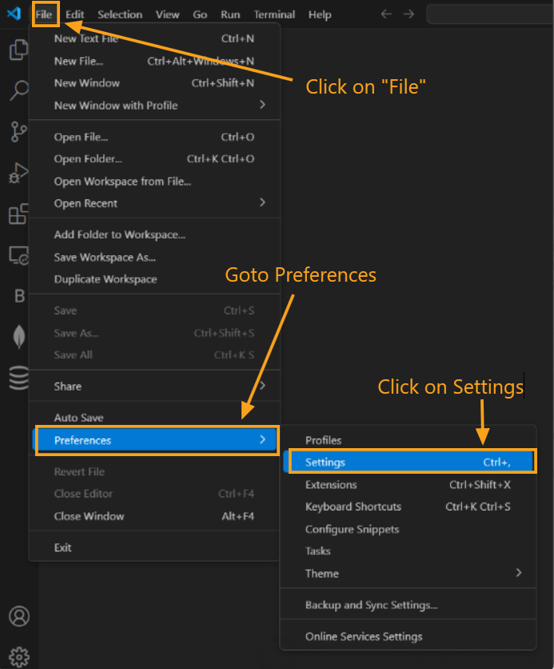
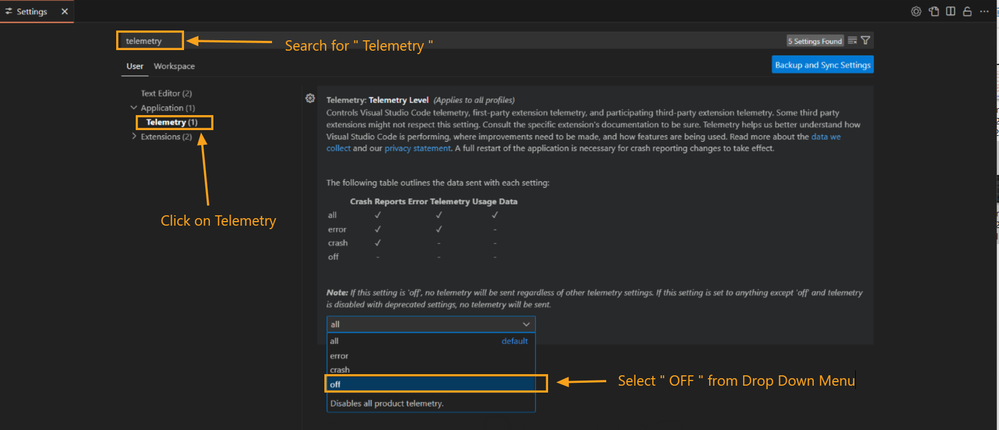

---

title: Telemetry
description: Understand how telemetry data is collected in DBCode to enhance product quality and user experience.
order: 10

---

## Telemetry in DBCode

To continuously improve the DBCode experience, we collect non-personally identifiable telemetry data when this setting is enabled in Visual Studio Code. Telemetry helps us understand which features are most used, the types of databases accessed, and instances of errors or crashes. This data provides valuable insights that enable us to identify and prioritize areas for improvement.

### How Telemetry Works

- **Data Collected:** Telemetry data includes information about the types of databases accessed, the features used within DBCode, and error occurrences. No personally identifiable information is collected.

- **Respect for VS Code Telemetry Settings:** DBCode follows the Visual Studio Code telemetry setting. If telemetry is disabled in your VS Code settings, DBCode will not collect any data.

- **Privacy Policy:** For more information on how we handle telemetry data, please review our [Privacy Policy](legal/privacy-policy).

### What Happens if Telemetry is Disabled?

If telemetry is disabled in Visual Studio Code, DBCode, along with all other installed extensions, will not collect or send any usage data. Disabling telemetry means we won't receive insights into how the extension is used, limiting our ability to make data-driven improvements and identify potential issues in real time. However, this setting will not impact your ability to use any DBCode features.

### Disabling Telemetry

To disable telemetry in DBCode, you can adjust the telemetry settings in Visual Studio Code:

1. **Open Settings:** In Visual Studio Code, go to **File** > **Preferences** > **Settings** (or press *Ctrl+,*).

    

2. **Search for Telemetry:** In the settings search bar, type “telemetry.”

3. **Disable Telemetry:** Toggle off **Telemetry: Enable Telemetry** to stop all telemetry data collection.

    

---

Enabling telemetry helps us improve DBCode by providing valuable insights while respecting your privacy. If telemetry is disabled, DBCode and other extensions will continue to function normally but without telemetry data for product enhancements.